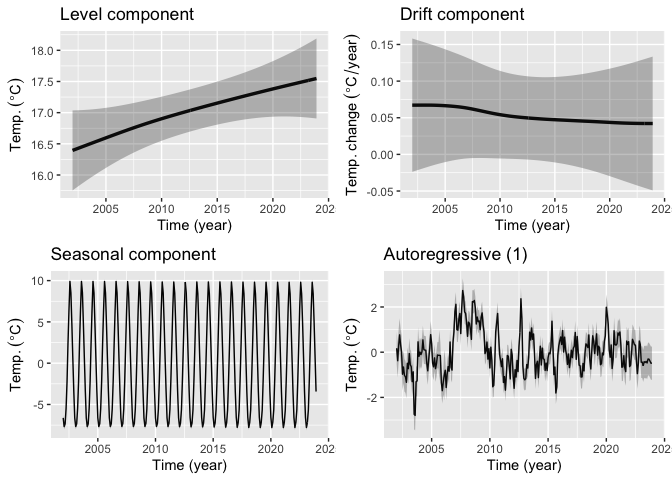

# tempssm

`tempssm` provides a practical R interface for state-space analysis of
temperature time series. The package focuses on linear Gaussian state-space
models estimated by Kalman filtering and smoothing, using the `KFAS` package
as the computational backend (Helske, 2017).

The package was previously named `ThermoSSM` and has been renamed to `tempssm`.

## Key Features

- Fits linear Gaussian state-space models to temperature time series.
- Represents temperature dynamics using interpretable latent components:
  level, seasonal variation, autoregressive structure, and optional
  exogenous effects.
- Supports arbitrary seasonal frequencies, while the current examples and
  validation focus primarily on monthly temperature data.
- Allows the autoregressive order to be specified by the user.
- Provides S3 methods for summaries, diagnostics, accessors, and plots.
- Includes time-series cross-validation tools for model evaluation.

## Prior Art and Scope

`tempssm` is not intended to introduce a new estimation theory or a new
state-space algorithm. Its core statistical machinery is based on established
linear Gaussian state-space modeling, Kalman filtering, and Kalman smoothing.
Model fitting is delegated to `KFAS`, which provides a general framework for
state-space models in R.

The contribution of `tempssm` is to provide a domain-focused workflow for
temperature time series. It combines model construction, component extraction,
uncertainty summaries, residual diagnostics, visualization, and time-series
cross-validation in a single API designed for temperature applications.

The initial implementation was adapted from the supplementary code provided by
Baba (2024), accompanying Baba et al. (2024), which analyzed sea temperature
trends using a linear Gaussian state-space model. The supplementary code is
publicly available at:

<https://github.com/logics-of-blue/sea-temperature-trend-jogashima>

Compared with that prior implementation, `tempssm` aims to provide a reusable
R package interface with input validation, documented S3 methods, tests,
diagnostics, cross-validation utilities, and examples for broader temperature
time-series analysis.

## Installation

```r
if (!requireNamespace("devtools", quietly = TRUE)) {
  install.packages("devtools")
}

devtools::install_github("akihirao/tempssm")
```

## Documentation

A short tutorial is available in the package vignette:

<https://github.com/akihirao/tempssm/blob/main/vignettes/tutorial.pdf>

A more detailed PDF manual is also available:

<https://github.com/akihirao/tempssm/blob/main/tools/manual/tempssm_manual.pdf>

## Basic Usage

### Load the Package and Example Data

This example uses monthly sea surface temperature (SST) data off Niigata,
Japan, from February 2002 to December 2023.

```r
library(tempssm)
data(niigata_sst)
```

### Fit a State-Space Model

The function `tempssm()` fits a linear Gaussian state-space model to a
temperature time series.

```r
res <- tempssm(niigata_sst)
```

The returned object is an S3 object of class `"tempssm"`. Results can be
inspected with standard methods.

```r
summary(res)
autoplot(res)
```



### Use Your Own Data

If you already have a `ts` object, pass it directly to `tempssm()`.

```r
res <- tempssm(my_ts)
```

For monthly temperature data stored in a CSV file, prepare columns named
`Year`, `Month`, and `Temp`.

```text
Year,Month,Temp
2010,8,13.6
2010,9,6.8
2010,10,NA
2010,11,-1.4
...
```

Use `NA` for missing temperature values, and keep the corresponding `Year` and
`Month` entries. The CSV file should be comma-separated and UTF-8 encoded.

```r
my_ts <- tempssm::read_monthly_temp_ts("temperature.csv")
res <- tempssm(my_ts)
```

`read_monthly_temp_ts()` uses base R's `ts()` representation internally. You
can also construct a `ts` object manually if finer control is needed.

## References

Baba, S. (2024). Supplementary code and test data for estimating sea
temperature trends using a linear Gaussian state-space model. GitHub
repository:
<https://github.com/logics-of-blue/sea-temperature-trend-jogashima>

Baba, S., Ishii, H., and Yoshiyama, T. (2024). Estimating sea temperature
trends using a linear Gaussian state-space model in Jogashima, Kanagawa,
Japan. *Bulletin of the Japanese Society of Fisheries Oceanography*, 88(3),
190-199. <https://doi.org/10.34423/jsfo.88.3_190>

Helske, J. (2017). KFAS: Exponential family state space models in R.
*Journal of Statistical Software*, 78(10), 1-39.
<https://doi.org/10.18637/jss.v078.i10>
