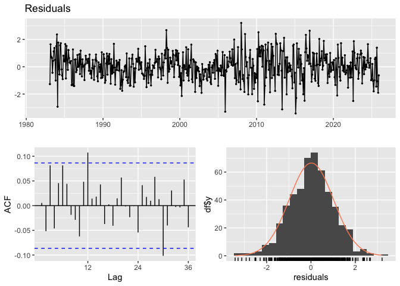

- [Set Ennvironment](#set-ennvironment)
- [Loading Example Data](#loading-example-data)
- [Checking Example Data](#checking-example-data)
- [Plotting Daily Time Series of Sea Surface
  Temperature](#plotting-daily-time-series-of-sea-surface-temperature)
- [Converting from Daily zoo bject to Monthly ts
  object](#converting-from-daily-zoo-bject-to-monthly-ts-object)
- [Check of ts object](#check-of-ts-object)
- [Plotting Monthly Time Series of Sea Surface
  Temperature](#plotting-monthly-time-series-of-sea-surface-temperature)
- [Plotting Time Series of Temperature
  Anomalies](#plotting-time-series-of-temperature-anomalies)
- [Plotting Monthly Seasonal Cycle](#plotting-monthly-seasonal-cycle)
- [Applying a Linear Gaussian State-Space
  Model](#applying-a-linear-gaussian-state-space-model)
- [Plotting Level, Drift, Seasonal, and Auto-Regressive
  Components](#plotting-level-drift-seasonal-and-auto-regressive-components)
- [Simple Model Diagnostics](#simple-model-diagnostics)
- [Estimated Parameters and
  Components](#estimated-parameters-and-components)
- [Plotting Level Component with 95% Confidence
  Interval](#plotting-level-component-with-95-confidence-interval)
- [Plotting Drift Component with 95% Confidence
  Interval](#plotting-drift-component-with-95-confidence-interval)
- [Appendix: Handling Raw Temperature
  Data](#appendix-handling-raw-temperature-data)

# Set Ennvironment

``` r
## Set libraries
library(ThermoSSM)

library(tidyverse)
library(forecast)
library(cowplot)

# initialize
rm(list=ls(all=TRUE))
```

# Loading Example Data

``` r
# loading example data 1: daily mean sea surface temperature time series off southern Ibaraki Prefecture, Japan
data(ibaraki_sst)
head(ibaraki_sst)
```

    ##             Temp
    ## 1982-01-01 16.21
    ## 1982-01-02 16.28
    ## 1982-01-03 16.36
    ## 1982-01-04 16.36
    ## 1982-01-05 16.22
    ## 1982-01-06 16.04

# Checking Example Data

``` r
class(ibaraki_sst) # zoo object
```

    ## [1] "zoo"

``` r
frequency(ibaraki_sst)   # frequency（1）
```

    ## [1] 1

``` r
start(ibaraki_sst)       # start time（"1982-01-01"）
```

    ## [1] "1982-01-01"

``` r
end(ibaraki_sst)         # end time（"2025-12-31"）
```

    ## [1] "2025-12-31"

# Plotting Daily Time Series of Sea Surface Temperature

``` r
daily_ibaraki_sst_plot <- forecast::autoplot(ibaraki_sst) +
  labs(y = expression(Temperature~(degree*C)), 
       x = "Time") +
  ggtitle("Daily mean sea-surface temperature off southern Ibaraki Prefecture")

#ggsave("Daily_SST_ibaraki_plot.png",
#       plot=daily_ibaraki_sst_plot,
#       width=8,height=6)

plot(daily_ibaraki_sst_plot)
```


# Converting from Daily zoo bject to Monthly ts object

``` r
monthly_ibaraki_sst <- zoo_daily2ts_monthly(ibaraki_sst)
```

# Check of ts object

``` r
class(monthly_ibaraki_sst) # ts object
```

    ## [1] "ts"

``` r
frequency(monthly_ibaraki_sst)   # frequency（12）
```

    ## [1] 12

``` r
start(monthly_ibaraki_sst)       # start time（1982, 1）
```

    ## [1] 1982    1

``` r
end(monthly_ibaraki_sst)         # end time（"2025, 12）
```

    ## [1] 2025   12

``` r
cycle(monthly_ibaraki_sst) %>% head() # 各観測の月番号（1～12）
```

    ##      Jan Feb Mar Apr May Jun
    ## 1982   1   2   3   4   5   6

``` r
time(monthly_ibaraki_sst)  %>% head() # 小数年（1982.000, 1982.083...）
```

    ##           Jan      Feb      Mar      Apr      May      Jun
    ## 1982 1982.000 1982.083 1982.167 1982.250 1982.333 1982.417

``` r
window(monthly_ibaraki_sst, start = c(2001, 1), end = c(2001, 12))  # 期間抽出
```

    ##           Jan      Feb      Mar      Apr      May      Jun      Jul      Aug
    ## 2001 16.30677 15.79500 15.03742 16.67533 18.87774 21.65100 24.97935 26.09419
    ##           Sep      Oct      Nov      Dec
    ## 2001 24.32400 22.53935 20.68533 18.92161

# Plotting Monthly Time Series of Sea Surface Temperature

``` r
monthly_ibaraki_sst_plot <- forecast::autoplot(monthly_ibaraki_sst) +
  labs(y = expression(Temperature~(degree*C)), 
       x = "Time") +
  ggtitle("Montly mean sea-surface temperature off southern Ibaraki Prefecture")

#ggsave("monthly_SST_ibaraki_plot.png",
#       plot=monthly_ibaraki_sst_plot,
#       width=8,height=6)

plot(monthly_ibaraki_sst_plot)
```


# Plotting Time Series of Temperature Anomalies

``` r
# Generate temperature anomalies
monthly_ibaraki_sst_anomaly <- ThermoSSM::monthly_anomaly(monthly_ibaraki_sst)

monthly_ibaraki_sst_anomaly_plot <- forecast::autoplot(monthly_ibaraki_sst_anomaly) +
  labs(y = expression(Temperature~(degree*C)), 
       x = "Time") +
  ggtitle("Sea-surface temperature anomaliese")
  
#ggsave("monthly_SST_dev_ibaraki.png",
#       plot=monthly_ibaraki_sst_anomaly_plot,
#       width=8,height=6)

plot(monthly_ibaraki_sst_anomaly_plot)
```


# Plotting Monthly Seasonal Cycle

``` r
monthly_seasonal_cycle_SST_ibaraki <- ThermoSSM::mean_seasonal_cycle(monthly_ibaraki_sst) 
summary(monthly_seasonal_cycle_SST_ibaraki)
```

    ##      Month        Temperature   
    ##  Min.   : 1.00   Min.   :13.90  
    ##  1st Qu.: 3.75   1st Qu.:15.47  
    ##  Median : 6.50   Median :18.42  
    ##  Mean   : 6.50   Mean   :18.82  
    ##  3rd Qu.: 9.25   3rd Qu.:21.87  
    ##  Max.   :12.00   Max.   :24.93

``` r
plt_monthly_seasonal_cycle_SST_ibaraki <- ggplot(data=monthly_seasonal_cycle_SST_ibaraki,
                                                 aes(x=Month,y=Temperature)) +
    geom_point(size = 2) +
    geom_line(linetype= "dashed") +
    labs(title="Monthly seasonal cycle of SST",
      y = expression(Temperature~(degree*C))) +
    scale_x_discrete(
      labels = function(x) sprintf("%02d", as.integer(x))
    )

#ggsave("monthly_SST_seasonal_ibaraki.png",
#       plot=plt_monthly_seasonal_cycle_SST_ibaraki,
#       width=8,height=6)

plot(plt_monthly_seasonal_cycle_SST_ibaraki)
```


# Applying a Linear Gaussian State-Space Model

``` r
res <- lgssm(monthly_ibaraki_sst)

print(res)
```

    ## ThermoSSM model fit
    ## ------------------
    ## Data:
    ##   Length      : 528 
    ##   Frequency   : 12 
    ##   Start / End : 1982-1  /  2025-12 
    ## 
    ## Optimization:
    ##   Converged   : TRUE 
    ##   LogLik      : -603 
    ## 
    ## Use summary() for detailed results.

``` r
summary(res)
```

    ## ThermoSSM summary
    ## -----------------
    ## Call:
    ## lgssm(ts_data = monthly_ibaraki_sst)
    ## 
    ## Model fit:
    ##   Log-likelihood : -603 
    ##   k              : 6 
    ##   AIC            : 1218 
    ##   Converged      : TRUE 
    ## 
    ## Variance parameters:
    ##   Observation (H): 1.72128e-43 
    ##   State (Q trend): 5.008495e-06 
    ##   State (Q season): 0.0001880851 
    ##   State (Q ar): 0.5141963 
    ## Coefficient of auto-regression parameters:
    ##   AR1: 0.6923188 
    ##   AR2: -0.1245904

# Plotting Level, Drift, Seasonal, and Auto-Regressive Components

``` r
# 全成分を一挙にプロット
plot(res)
```


# Simple Model Diagnostics

``` r
## normality of residuals
# 標準化残差
std_obs_resid <- rstandard(res$kfs, type = "recursive")

# forecastパッケージのcheckredisuals関数で残差のチェック
# Ljung–Box検定: P > 0.05で残差に有意な自己相関なしと判断
checkresiduals(std_obs_resid)
```



    ## 
    ##  Ljung-Box test
    ## 
    ## data:  Residuals
    ## Q* = 28.235, df = 24, p-value = 0.2502
    ## 
    ## Model df: 0.   Total lags used: 24

``` r
# 図示された残差（上：残差系列；左下：残差コレログラム；右下：残差のヒストグラム）をみて異常に突出した残差がないかなどを確認


## normality of residuals
# P > 0.05で正規分布と有意に異なっていないと判断
shapiro.test(std_obs_resid)
```

    ## 
    ##  Shapiro-Wilk normality test
    ## 
    ## data:  std_obs_resid
    ## W = 0.99552, p-value = 0.1467

# Estimated Parameters and Components

``` r
#過程誤差、観測誤差などのパラメーター
params <- ThermoSSM::extract_param(res)
params
```

    ##       Q_trend      Q_season           AR1           AR2          Q_ar 
    ##  5.008495e-06  1.880851e-04  6.923188e-01 -1.245904e-01  5.141963e-01 
    ##             H 
    ##  1.721280e-43

``` r
# 平滑化推定量
alpha_hat <- res$kfs$alphahat
head(alpha_hat)
```

    ##             level      slope sea_dummy1 sea_dummy2 sea_dummy3 sea_dummy4
    ## Jan 1982 17.45868 0.01625144  -3.470558  -1.801915  0.3388803  2.7790543
    ## Feb 1982 17.47493 0.01625139  -4.958038  -3.470558 -1.8019153  0.3388803
    ## Mar 1982 17.49118 0.01626273  -4.824835  -4.958038 -3.4705577 -1.8019153
    ## Apr 1982 17.50744 0.01628112  -3.279939  -4.824835 -4.9580380 -3.4705577
    ## May 1982 17.52372 0.01630892  -1.203128  -3.279939 -4.8248350 -4.9580380
    ## Jun 1982 17.54003 0.01635052   1.263210  -1.203128 -3.2799392 -4.8248350
    ##          sea_dummy5 sea_dummy6 sea_dummy7 sea_dummy8 sea_dummy9 sea_dummy10
    ## Jan 1982  5.2114469  6.1168103  3.8290115  1.2632100  -1.203128   -3.279939
    ## Feb 1982  2.7790543  5.2114469  6.1168103  3.8290115   1.263210   -1.203128
    ## Mar 1982  0.3388803  2.7790543  5.2114469  6.1168103   3.829011    1.263210
    ## Apr 1982 -1.8019153  0.3388803  2.7790543  5.2114469   6.116810    3.829011
    ## May 1982 -3.4705577 -1.8019153  0.3388803  2.7790543   5.211447    6.116810
    ## Jun 1982 -4.9580380 -3.4705577 -1.8019153  0.3388803   2.779054    5.211447
    ##          sea_dummy11    arima1      arima2
    ## Jan 1982   -4.824835 1.0560742 -0.06457844
    ## Feb 1982   -3.279939 1.7081096 -0.13157670
    ## Mar 1982   -1.203128 0.9726874 -0.21281405
    ## Apr 1982    1.263210 1.0918300 -0.12118751
    ## May 1982    3.829011 1.2019851 -0.13603153
    ## Jun 1982    6.116810 0.7197574 -0.14975580

``` r
#　水準成分の平滑化推定量
level_ts <- ThermoSSM::extract_level_ts(res)

#　ドリフト成分の平滑化推定量
drift_ts <- ThermoSSM::extract_drift_ts(res)

# 年あたりの平均的な昇温率
mean_drift_year <- mean(drift_ts) * 12
print(mean_drift_year)
```

    ## [1] 0.06181994

``` r
# 1990年代における年あたりの平均昇温率
drift_1990s_per_year <- window(drift_ts,
                               start=c(1990,1),
                               end=c(1999,12)
                               ) %>%  mean()*12
print(drift_1990s_per_year)
```

    ## [1] 0.04776358

``` r
# 2010年代における年あたりの平均昇温率
drift_2010s_per_year <- window(drift_ts,
                               start=c(2010,1),
                               end=c(2019,12)
                               ) %>%  mean()*12
print(drift_2010s_per_year)
```

    ## [1] 0.1152325

# Plotting Level Component with 95% Confidence Interval

``` r
plt_level_ci <- plot(res,
                     components = "level",
                     ci = TRUE,
                     ci_level = 0.95
                     )

#ggsave("level_plot.png",
#       width=6, height=4,
#       plot = plt_level_ci)

plot(plt_level_ci)
```


# Plotting Drift Component with 95% Confidence Interval

``` r
plt_drift_ci <- plot(res,
                     components = "drift",
                     ci = TRUE,
                     ci_level = 0.95
                     )

#ggsave("drift_plot.png",
#       width=6, height=4,
#       plot = plt_drift_ci)

plot(plt_drift_ci)
```


# Appendix: Handling Raw Temperature Data

``` r
##========================
## Example 1
# Monthly temperature data
original_data <- data.frame(
  Year=c(2000,2000,2000,2000,2000,2000,2000,2000,2000,2000,2000,2000),
  Month=c(1,2,3,4,5,6,7,8,9,10,11,12),
  Temp=   c(5.2, 6.1, 9.3, 13.5, 17.8, 21.0,24.3, 25.1, 22.0, 17.1, 11.2,7.0))

head(original_data)
```

    ##   Year Month Temp
    ## 1 2000     1  5.2
    ## 2 2000     2  6.1
    ## 3 2000     3  9.3
    ## 4 2000     4 13.5
    ## 5 2000     5 17.8
    ## 6 2000     6 21.0

``` r
# Convert ts object
original_ts <- ts(
  matrix(original_data$Temp),
  start = c(original_data$Year[1],original_data$Month[1]),
  frequency = 12
)

# Important!!: Exe colnames() to add "Temp" name to ts object for the model 
colnames(original_ts) <- c("Temp")

frequency(original_ts)
```

    ## [1] 12

``` r
start(original_ts)
```

    ## [1] 2000    1

``` r
end(original_ts)
```

    ## [1] 2000   12

``` r
time(original_ts)
```

    ##           Jan      Feb      Mar      Apr      May      Jun      Jul      Aug
    ## 2000 2000.000 2000.083 2000.167 2000.250 2000.333 2000.417 2000.500 2000.583
    ##           Sep      Oct      Nov      Dec
    ## 2000 2000.667 2000.750 2000.833 2000.917

``` r
original_ts
```

    ##       Jan  Feb  Mar  Apr  May  Jun  Jul  Aug  Sep  Oct  Nov  Dec
    ## 2000  5.2  6.1  9.3 13.5 17.8 21.0 24.3 25.1 22.0 17.1 11.2  7.0

``` r
##========================
## Example 2
# loading and checking raw csv data
input_csv <- "./data/test_data.csv"
raw_csv <- read_csv(input_csv)
head(raw_csv)
```

    ## # A tibble: 6 × 3
    ##    Year Month  Temp
    ##   <dbl> <dbl> <dbl>
    ## 1  2002     1 -15.1
    ## 2  2002     2 -13.3
    ## 3  2002     3 -10.6
    ## 4  2002     4  -0.8
    ## 5  2002     5   3.5
    ## 6  2002     6   6.2

``` r
# Load original csv file and then convert to monthly ts object 
test_ts <- ThermoSSM::monthly_csv2ts(input_csv)
head(test_ts)
```

    ##        Jan   Feb   Mar   Apr   May   Jun
    ## 2002 -15.1 -13.3 -10.6  -0.8   3.5   6.2

``` r
frequency(test_ts)
```

    ## [1] 12

``` r
start(test_ts)
```

    ## [1] 2002    1

``` r
end(test_ts)
```

    ## [1] 2025   12

``` r
cycle(test_ts) %>% head()
```

    ##      Jan Feb Mar Apr May Jun
    ## 2002   1   2   3   4   5   6

``` r
time(test_ts) %>% head()
```

    ##           Jan      Feb      Mar      Apr      May      Jun
    ## 2002 2002.000 2002.083 2002.167 2002.250 2002.333 2002.417
