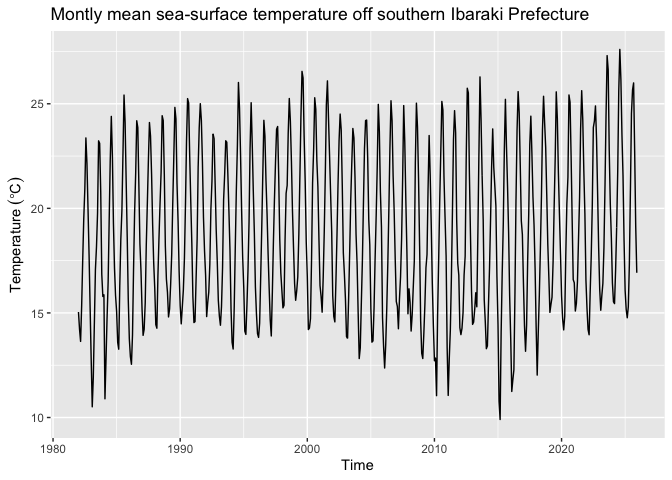
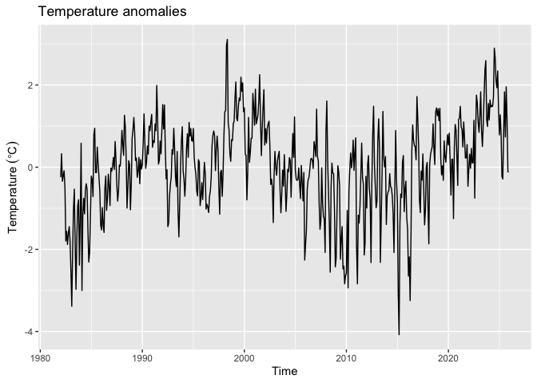
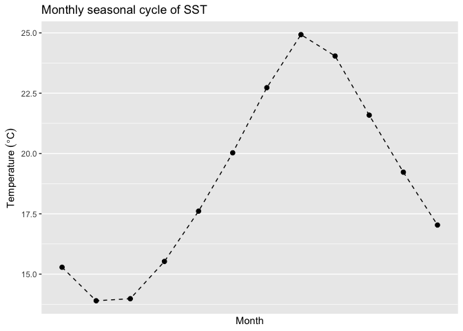
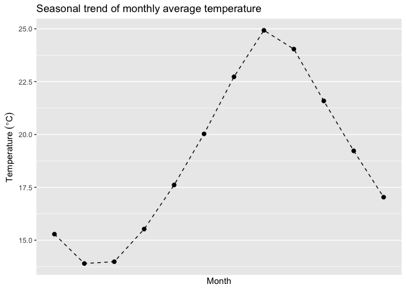
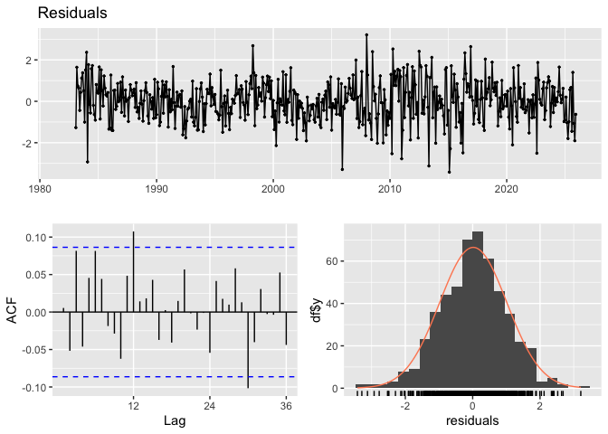
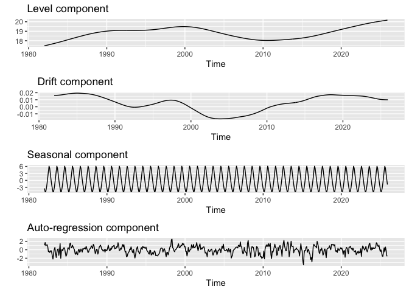
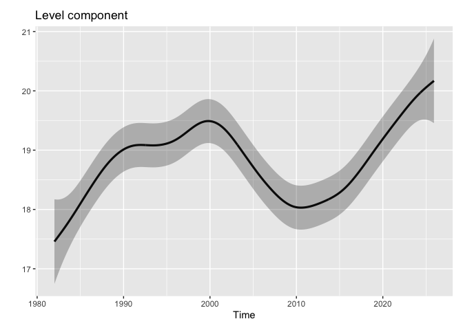
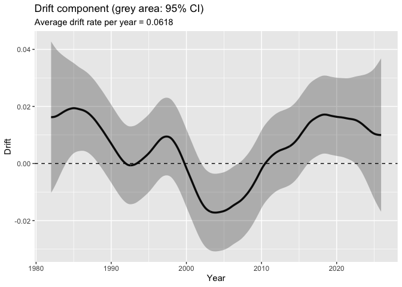

- [Set ennvironment](#set-ennvironment)
- [Loading example data](#loading-example-data)
- [Checking example data](#checking-example-data)
- [Plotting daily time series of sea surface
  temperature](#plotting-daily-time-series-of-sea-surface-temperature)
- [Converting from daily zoo object to monthly ts
  object](#converting-from-daily-zoo-object-to-monthly-ts-object)
- [Check of ts object](#check-of-ts-object)
- [Plotting monthly time series of sea surface
  temperature](#plotting-monthly-time-series-of-sea-surface-temperature)
- [Plotting time series of temperature
  deviation](#plotting-time-series-of-temperature-deviation)
- [Plotting seasonal pattern of monthly
  temperature](#plotting-seasonal-pattern-of-monthly-temperature)
- [Applying a Linear Gaussian State-Space
  Model](#applying-a-linear-gaussian-state-space-model)
- [Simple Model Diagnostics](#simple-model-diagnostics)
- [Parameter Estimation of the
  Model](#parameter-estimation-of-the-model)
- [Plotting estimates of the level, drift, seasonal, and auto-regression
  components](#plotting-estimates-of-the-level-drift-seasonal-and-auto-regression-components)
- [Plotting level component with confidence
  interval](#plotting-level-component-with-confidence-interval)
- [Plotting drift component with confidence
  interval](#plotting-drift-component-with-confidence-interval)

# Set ennvironment

``` r
## Set libraries
library(ThermoSSM)

library(tidyverse)
library(forecast)
library(cowplot)

# initialize
rm(list=ls(all=TRUE))
```

# Loading example data

``` r
# loading example data 1: daily mean sea surface temperature time series off southern Ibaraki Prefecture, Japan
data(ibaraki_sst)
head(ibaraki_sst)
```

    ##             Temp
    ## 1982-01-01 16.21
    ## 1982-01-02 16.28
    ## 1982-01-03 16.36
    ## 1982-01-04 16.36
    ## 1982-01-05 16.22
    ## 1982-01-06 16.04

# Checking example data

``` r
class(ibaraki_sst) # zoo object
```

    ## [1] "zoo"

``` r
frequency(ibaraki_sst)   # frequency（1）
```

    ## [1] 1

``` r
start(ibaraki_sst)       # start time（"1982-01-01"）
```

    ## [1] "1982-01-01"

``` r
end(ibaraki_sst)         # end time（"2025-12-31"）
```

    ## [1] "2025-12-31"

# Plotting daily time series of sea surface temperature

``` r
daily_ibaraki_sst_plot <- forecast::autoplot(ibaraki_sst) +
  labs(y = expression(Temperature~(degree*C)), 
       x = "Time") +
  ggtitle("Daily mean sea-surface temperature off southern Ibaraki Prefecture")

ggsave("Daily_SST_ibaraki_plot.png",
       plot=daily_ibaraki_sst_plot,
       width=8,height=6)

plot(daily_ibaraki_sst_plot)
```


# Converting from daily zoo object to monthly ts object

``` r
monthly_ibaraki_sst <- zoo_daily2ts_monthly(ibaraki_sst)
```

# Check of ts object

``` r
class(monthly_ibaraki_sst) # ts object
```

    ## [1] "ts"

``` r
frequency(monthly_ibaraki_sst)   # frequency（12）
```

    ## [1] 12

``` r
start(monthly_ibaraki_sst)       # start time（1982, 1）
```

    ## [1] 1982    1

``` r
end(monthly_ibaraki_sst)         # end time（"2025, 12）
```

    ## [1] 2025   12

``` r
cycle(monthly_ibaraki_sst) %>% head() # 各観測の月番号（1～12）
```

    ##      Jan Feb Mar Apr May Jun
    ## 1982   1   2   3   4   5   6

``` r
time(monthly_ibaraki_sst)  %>% head() # 小数年（1982.000, 1982.083...）
```

    ##           Jan      Feb      Mar      Apr      May      Jun
    ## 1982 1982.000 1982.083 1982.167 1982.250 1982.333 1982.417

``` r
window(monthly_ibaraki_sst, start = c(2001, 1), end = c(2001, 12))  # 期間抽出
```

    ##           Jan      Feb      Mar      Apr      May      Jun      Jul      Aug
    ## 2001 16.30677 15.79500 15.03742 16.67533 18.87774 21.65100 24.97935 26.09419
    ##           Sep      Oct      Nov      Dec
    ## 2001 24.32400 22.53935 20.68533 18.92161

# Plotting monthly time series of sea surface temperature

``` r
monthly_ibaraki_sst_plot <- forecast::autoplot(monthly_ibaraki_sst) +
  labs(y = expression(Temperature~(degree*C)), 
       x = "Time") +
  ggtitle("Montly mean sea-surface temperature off southern Ibaraki Prefecture")

ggsave("monthly_SST_ibaraki_plot.png",
       plot=monthly_ibaraki_sst_plot,
       width=8,height=6)

plot(monthly_ibaraki_sst_plot)
```



# Plotting time series of temperature deviation

``` r
plot_temp_dev_obj <- ThermoSSM::plot_temp_dev(monthly_ibaraki_sst) 
```



``` r
ggsave("monthly_SST_dev_ibaraki.png",
       plot=plot_temp_dev_obj,
       width=8,height=6)
plot(plot_temp_dev_obj)
```


# Plotting seasonal pattern of monthly temperature

``` r
plot_monthly_SST_seasonal_ibaraki <- ThermoSSM::plot_typical_seasonal_cycle(monthly_ibaraki_sst) 
```



``` r
ggsave("monthly_SST_seasonal_ibaraki.png",
       plot=plot_monthly_SST_seasonal_ibaraki,
       width=8,height=6)
plot(plot_monthly_SST_seasonal_ibaraki)
```



# Applying a Linear Gaussian State-Space Model

``` r
res <- lgssm(monthly_ibaraki_sst)
fit    <- res[[1]] # fit model
smooth <- res[[2]] # smoothing

ci <- confint(smooth, level = 0.95) # 95% confident interval
```

# Simple Model Diagnostics

``` r
##  model convergence
# OK when return of 0
fit$optim.out$convergence
```

    ## [1] 0

``` r
## normality of residuals
# 標準化残差
std_obs_resid <- rstandard(smooth, type = "recursive")

# forecastパッケージのcheckredisuals関数で残差のチェック
# Ljung–Box検定: P > 0.05で残差に有意な自己相関なしと判断
checkresiduals(std_obs_resid)
```



    ## 
    ##  Ljung-Box test
    ## 
    ## data:  Residuals
    ## Q* = 28.235, df = 24, p-value = 0.2502
    ## 
    ## Model df: 0.   Total lags used: 24

``` r
# 図示された残差（上：残差系列；左下：残差コレログラム；右下：残差のヒストグラム）をみて異常に突出した残差がないかなどを確認


## normality of residuals
# P > 0.05で正規分布と有意に異なっていないと判断
shapiro.test(std_obs_resid)
```

    ## 
    ##  Shapiro-Wilk normality test
    ## 
    ## data:  std_obs_resid
    ## W = 0.99552, p-value = 0.1467

# Parameter Estimation of the Model

``` r
# 推定パラメーター(過程誤差、観測誤差など)
pars_comp <- ThermoSSM::extract_pars(res)
pars_comp
```

    ##       Q_trend      Q_season           AR1           AR2          Q_ar 
    ##  5.008495e-06  1.880851e-04  6.923188e-01 -1.245904e-01  5.141963e-01 
    ##             H 
    ##  1.721280e-43

``` r
# 平滑化推定量
alpha_hat <- smooth$alphahat
head(alpha_hat)
```

    ##             level      slope sea_dummy1 sea_dummy2 sea_dummy3 sea_dummy4
    ## Jan 1982 17.45868 0.01625144  -3.470558  -1.801915  0.3388803  2.7790543
    ## Feb 1982 17.47493 0.01625139  -4.958038  -3.470558 -1.8019153  0.3388803
    ## Mar 1982 17.49118 0.01626273  -4.824835  -4.958038 -3.4705577 -1.8019153
    ## Apr 1982 17.50744 0.01628112  -3.279939  -4.824835 -4.9580380 -3.4705577
    ## May 1982 17.52372 0.01630892  -1.203128  -3.279939 -4.8248350 -4.9580380
    ## Jun 1982 17.54003 0.01635052   1.263210  -1.203128 -3.2799392 -4.8248350
    ##          sea_dummy5 sea_dummy6 sea_dummy7 sea_dummy8 sea_dummy9 sea_dummy10
    ## Jan 1982  5.2114469  6.1168103  3.8290115  1.2632100  -1.203128   -3.279939
    ## Feb 1982  2.7790543  5.2114469  6.1168103  3.8290115   1.263210   -1.203128
    ## Mar 1982  0.3388803  2.7790543  5.2114469  6.1168103   3.829011    1.263210
    ## Apr 1982 -1.8019153  0.3388803  2.7790543  5.2114469   6.116810    3.829011
    ## May 1982 -3.4705577 -1.8019153  0.3388803  2.7790543   5.211447    6.116810
    ## Jun 1982 -4.9580380 -3.4705577 -1.8019153  0.3388803   2.779054    5.211447
    ##          sea_dummy11    arima1      arima2
    ## Jan 1982   -4.824835 1.0560742 -0.06457844
    ## Feb 1982   -3.279939 1.7081096 -0.13157670
    ## Mar 1982   -1.203128 0.9726874 -0.21281405
    ## Apr 1982    1.263210 1.0918300 -0.12118751
    ## May 1982    3.829011 1.2019851 -0.13603153
    ## Jun 1982    6.116810 0.7197574 -0.14975580

``` r
#　水準成分の平滑化推定量
level_ts <- ThermoSSM::extract_level(res)

#　ドリフト成分の平滑化推定量
drift_ts <- ThermoSSM::extract_drift(res)

# 年あたりの平均的な昇温率
mean_drift_year <- mean(drift_ts) * 12
print(mean_drift_year)
```

    ## [1] 0.06181994

``` r
# 1990年代における年あたりの平均昇温率
drift_1990s_per_year <- window(drift_ts,
                               start=c(1990,1),
                               end=c(1999,12)
                               ) %>%  mean()*12
print(drift_1990s_per_year)
```

    ## [1] 0.04776358

``` r
# 2010年代における年あたりの平均昇温率
drift_2010s_per_year <- window(drift_ts,
                               start=c(2010,1),
                               end=c(2019,12)
                               ) %>%  mean()*12
print(drift_2010s_per_year)
```

    ## [1] 0.1152325

# Plotting estimates of the level, drift, seasonal, and auto-regression components

``` r
plt_comp <- ThermoSSM::plot_level_trend_season_ar(res)
plot_four_comp <- cowplot::plot_grid(plt_comp[[1]],
                   plt_comp[[2]],
                   plt_comp[[3]],
                   plt_comp[[4]],
                   ncol=1) 

ggsave("plot_level_trend_season_ar.png",
       plot=plot_four_comp,
       width=8,height=8)
plot_four_comp
```



# Plotting level component with confidence interval

``` r
plt_level_ci <- ThermoSSM::plot_level_ci(res,
                              ci_range = 0.95)

ggsave("level_plot.png",
       width=6, height=4,
       plot = plt_level_ci)

plot(plt_level_ci)
```



# Plotting drift component with confidence interval

``` r
plt_drift_ci <- ThermoSSM::plot_drift_ci(res,
                              ci_range = 0.95)

ggsave("drift_plot.png",
       width=6, height=4,
       plot = plt_drift_ci)

plot(plt_drift_ci)
```


