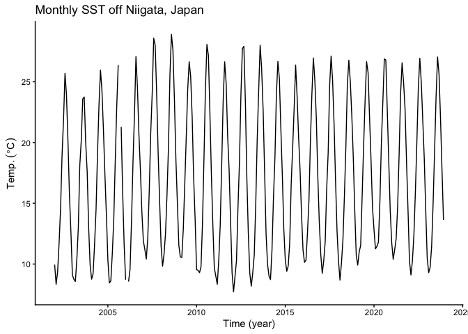
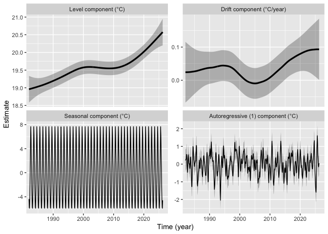
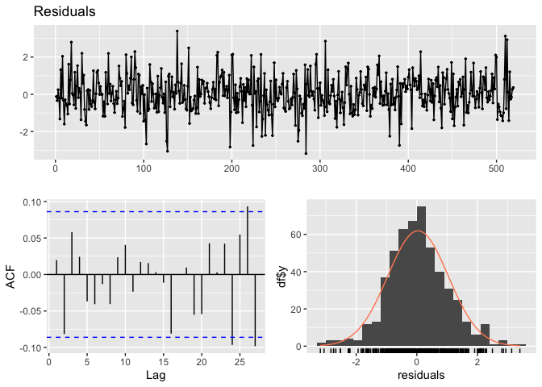
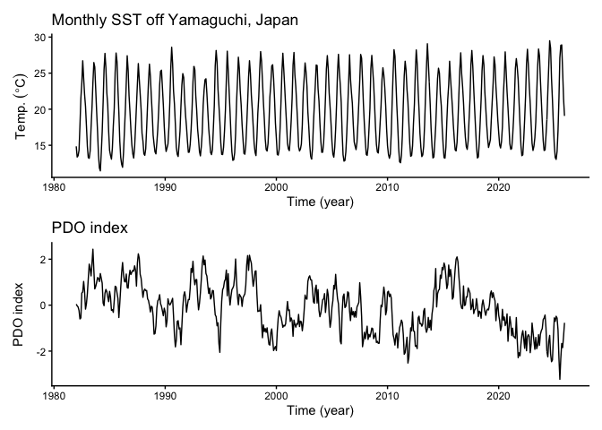
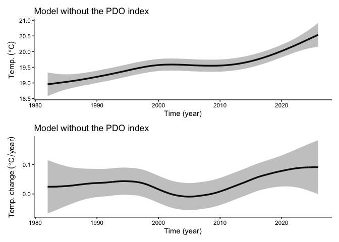
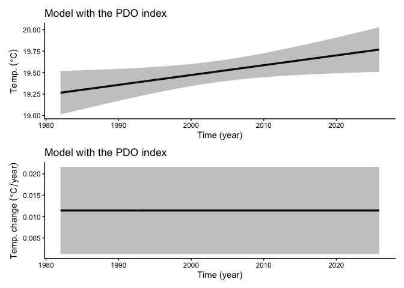
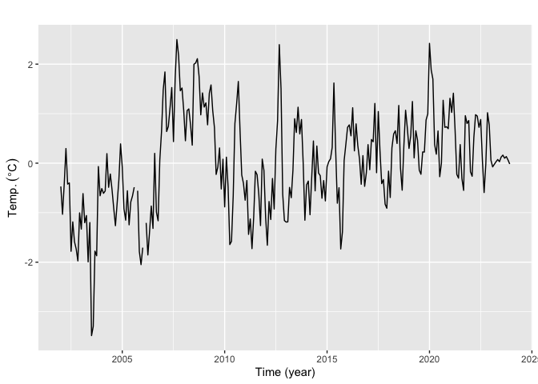
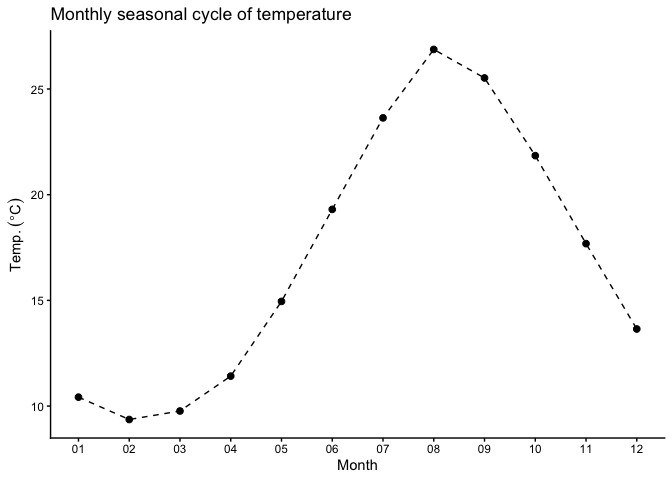

# Summary

`tempssm` provides a practical R interface for state-space analysis of
temperature time series. The package focuses on linear Gaussian
state-space models estimated by Kalman filtering and smoothing, using
the `KFAS` package as the computational backend (Helske, 2017).

# Key Features

- Fits linear Gaussian state-space models to temperature time series.
- Represents temperature dynamics using interpretable latent components:
  long-term trend, seasonal variation, autoregressive structure, and
  optional exogenous effects.
- Supports arbitrary seasonal frequencies, while the current examples
  and validation focus primarily on monthly temperature data.
- Allows the autoregressive order to be specified by the user.
- Provides S3 methods for summaries, diagnostics,and plots.
- Includes time-series cross-validation tools for model evaluation.

# Prior Art and Scope

`tempssm` provides a domain-focused workflow for analyzing temperature
time series with linear Gaussian state-space models. It brings together
model construction, component extraction, uncertainty summaries,
residual diagnostics, visualization, and time-series cross-validation in
a single R package interface tailored to temperature applications.

The package builds on established statistical methodology, including
linear Gaussian state-space modeling, Kalman filtering, and Kalman
smoothing. Model estimation is handled through the `KFAS` package, which
provides a general framework for state-space models in R.

The initial implementation was adapted from the supplementary code
provided by Baba (2024), accompanying Baba et al. (2024), which analyzed
sea temperature trends using a linear Gaussian state-space model. The
supplementary code is publicly available at:

<https://github.com/logics-of-blue/sea-temperature-trend-jogashima>

Compared with that prior implementation, `tempssm` extends the workflow
into a reusable R package interface with input validation, documented S3
methods, tests, diagnostics, cross-validation utilities, and examples
for broader temperature time-series analysis.

The next section describes the state-space model used by `tempssm` and
clarifies how the trend, seasonal, autoregressive, and exogenous
components are represented.

# State-Space Model in **tempssm**

We consider an extended version of the Basic Structural Time Series
Model (BSTSM) to describe temperature time series with explicit
long-term trend, seasonal variability, and auto-regressive component.
The observation equation is given by
``` math
y_t = \alpha_t + v_t. \tag{1}
```
where $`t`$ denotes the time index, $`y_t`$ is the observed temperature,
$`\alpha_t`$ is the latent state, and $`v_t`$ is the observation error.

The latent state is decomposed as
``` math
\alpha_t = \mu_t + s_t + r_t + E_t. \tag{2}
```
where $`\mu_t`$ is the long-term trend component, $`s_t`$ is the
seasonal component, $`r_t`$ is a stationary autoregressive component,
and $`E_t`$ is the contribution of exogenous variables.

The level component follows a second-order stochastic process:
``` math
\mu_t = 2\mu_{t-1} - \mu_{t-2} + \zeta_t, \qquad \zeta_t \sim \mathcal{N}(0, \sigma_\zeta^2). \tag{3}
```
where $`\zeta_t`$ is the process error of the long-term trend component.

The seasonal component is modeled with a sum-to-zero constraint:
``` math
s_t = - \sum_{i=t-f}^{t-1} s_i + \omega_t, \qquad \omega_t \sim \mathcal{N}(0, \sigma_\omega^2). \tag{4}
```
where $`\omega_t`$ is the process error of the seasonal component and
$`f`$ denotes the seasonal frequency (for example, $`f=12`$ for monthly
data). This formulation makes seasonal effects identifiable and
comparable across different temporal resolutions. By imposing the
sum-to-zero constraint over one complete seasonal cycle, the seasonal
component captures recurring deviations from the underlying long-term
trend without introducing long-term drift. In models without a seasonal
component, the seasonal term $`s_t`$ is set to zero and omitted from the
state equation.

The autoregressive component follows an $`l`$th-order autoregressive
(AR) process:
``` math
r_t = \phi_1 r_{t-1} + \phi_2 r_{t-2} + \cdots + \phi_l r_{t-l} + \tau_t,
\qquad \tau_t \sim \mathcal{N}(0, \sigma_\tau^2). \tag{5}
```
Here, $`\tau_t`$ denotes the process error of the autoregressive
component. The process error terms ($`\zeta_t`$, $`\omega_t`$, and
$`\tau_t`$) are assumed to be mutually independent and normally
distributed.

The exogenous component is defined as
``` math
E_t = \beta_1 x_{1,t} + \beta_2 x_{2,t} + \cdots + \beta_m x_{m,t}. \tag{6}
```
The exogenous term $`E_t`$ represents the influence of external factors.
These may include large-scale climate indices, regional environmental
variables, or other physically motivated predictors relevant to the
observed temperature time series. Each exogenous variable enters the
model linearly through a time-invariant regression coefficient
($`\beta_1, \beta_2, \ldots, \beta_m`$), allowing the magnitude and
direction of its contribution to be estimated jointly with the latent
state components.

When applying the model to observational data, the total number of
parameters to be estimated ($`k`$) depends on the order of the
autoregressive component and the number of exogenous variables included
in the model. For example, in a model with a second-order autoregressive
component and no exogenous covariates, six parameters are estimated: the
observation error variance, the process error variances associated with
the long-term trend, seasonal, and autoregressive components, and the
first- and second-order autoregressive coefficients ($`\phi_1`$ and
$`\phi_2`$). In the general case with an $`l`$th-order autoregressive
component and $`m`$ exogenous variables, the total number of parameters
is $`k = 4 + l + m`$.

The core implementation of parameter estimation procedure is based on
the supplementary code provided by Baba et al. (2024). Parameter
estimation is performed using a two-step optimization strategy
recommended by Helske (2017). In the first step, model parameters are
estimated using the Nelder-Mead method (Nelder & Mead, 1965) with
user-specified initial values. The resulting estimates are then used as
initial values in a second optimization step based on the BFGS algorithm
(Shanno, 1970). The main model-fitting function, `tempssm()`, returns
both filtering and smoothing estimates. Unless otherwise stated, all
results presented in this vignette are based on the smoothed estimates.

# How to Use

## Set Environment

Load the following R packages to run the examples below. If any packages
are not installed, please install them as needed.

``` r
## Set libraries
library(tempssm)
library(forecast)

library(purrr) 
library(tibble)
library(readr)
library(dplyr)
library(ggplot2)

library(patchwork)
```

## Input Data Format

Input data for **tempssm** must be supplied as an R `ts` object, which
represents a regularly spaced time series (see `?stats::ts` or
<https://stat.ethz.ch/R-manual/R-devel/library/stats/html/ts.html>).

To support data preparation, the package includes utility functions that
convert external observational data into `ts` objects (see Appendix).

## Exercise I: Applying a State-Space Model to a Univariate Temperature Time Series

### Objective

In Exercise I, we apply a linear Gaussian state-space model to a
univariate temperature time series. This exercise introduces basic
modeling without exogenous variables and examines the role of
autoregressive dynamics.

### Loading the Sea Surface Temperature (SST) Dataset

A sample sea surface temperature (SST) dataset is included in the
package.

- **Dataset**: Monthly sea surface temperature (SST) off Yamaguchi
  Pref., Japan\
- **Unit**: °C\
- **Period**: February 2002 to December 2023

This dataset was created by aggregating daily SST data obtained from the
Japan Meteorological Agency website
(<https://www.jma.go.jp/jma/indexe.html>) into monthly values.

``` r
data(yamaguchi_sst) # load a ts object of SST off Niigata
head(yamaguchi_sst)
```

    ##           Jan      Feb      Mar      Apr      May      Jun
    ## 1982 14.85516 13.36500 13.55645 14.29933 17.72419 21.53000

``` r
summary(yamaguchi_sst)
```

    ##       Temp      
    ##  Min.   :11.45  
    ##  1st Qu.:15.13  
    ##  Median :18.84  
    ##  Mean   :19.54  
    ##  3rd Qu.:23.63  
    ##  Max.   :29.49

### Plotting the Monthly SST Time Series

We begin by visualizing the monthly SST time series to examine its
overall structure, including apparent trends, seasonal variability, and
the presence or absence of missing observations.

``` r
plt_yamaguchi_sst <- forecast::autoplot(yamaguchi_sst) +
  labs(y = expression(Temp.~(degree*C)), 
       x = "Time (year)") +
  ggtitle("Monthly SST off Yamaguchi, Japan") +
  theme_classic()

plot(plt_yamaguchi_sst)
```

<!-- -->

### Applying a Linear Gaussian State-Space Model

When a `ts` object containing temperature time-series data (here,
`yamaguchi_sst`) is passed to the core function `tempssm()`, model
construction and parameter estimation are performed together. The
returned S3 object of class `tempssm` (here, `res_ar1`) stores the
filtering and smoothing estimates, as well as the constructed model and
input data. By default, `tempssm()` fits a first-order autoregressive
model.

``` r
# model with first-order autoregressive component
res_ar1 <- tempssm(yamaguchi_sst) # (ar_order=1: default)
summary(res_ar1)
```

    ## tempssm summary
    ## -----------------
    ## Call:
    ## tempssm(temp_data = yamaguchi_sst)
    ## 
    ## Model fit:
    ##   Likelihood type: diffuse 
    ##   Log-likelihood : -470.61 
    ##   k              : 5 
    ##   AIC            : 951.21 
    ##   Converged      : TRUE 
    ## 
    ## Variance parameters:
    ##   Observation (H): 4.542027e-14 
    ##   State (Q trend): 9.936473e-08 
    ##   State (Q season): 8.408352e-56 
    ##   State (Q ar): 0.3145626 
    ## 
    ## Components of auto-regression:
    ##   Order of AR: 1 
    ##   Coefficient of AR1: 0.6202321

From the summary output, confirm that the model has converged
(`Converged: TRUE`). The output also reports statistics such as the
number of parameters (`k`), the log-likelihood, and the Akaike
Information Criterion (AIC). The parameter estimates include the
observation error variance (`H`), the process error variance of the
long-term trend component (`Q trend`), the process error variance of the
seasonal component (`Q season`), the process error variance of the
autoregressive component, and the first-order autoregressive coefficient
(`AR1`).

### Examining the Autoregressive (AR) Order

Next, we examine how the autoregressive (AR) order affects model
behavior. Specifically, we fit three models in which the order of the
autoregressive component varies from 1 to 3, while all other model
components, including the explicit seasonal cycle, are kept the same.
Because the first-order model has already been fitted, we now fit the
second- and third-order models.

``` r
# model with second-order autoregressive component
res_ar2 <- tempssm(yamaguchi_sst,ar_order=2) 
summary(res_ar2)
```

    ## tempssm summary
    ## -----------------
    ## Call:
    ## tempssm(temp_data = yamaguchi_sst, ar_order = 2)
    ## 
    ## Model fit:
    ##   Likelihood type: diffuse 
    ##   Log-likelihood : -467.66 
    ##   k              : 6 
    ##   AIC            : 947.33 
    ##   Converged      : TRUE 
    ## 
    ## Variance parameters:
    ##   Observation (H): 0.120908 
    ##   State (Q trend): 2.206262e-07 
    ##   State (Q season): 5.525557e-16 
    ##   State (Q ar): 0.1044204 
    ## 
    ## Components of auto-regression:
    ##   Order of AR: 2 
    ##   Coefficient of AR1: 1.185818 
    ##   Coefficient of AR2: -0.4790522

``` r
# model with third-order autoregressive component
res_ar3 <- tempssm(yamaguchi_sst,ar_order=3) 
summary(res_ar3)
```

    ## tempssm summary
    ## -----------------
    ## Call:
    ## tempssm(temp_data = yamaguchi_sst, ar_order = 3)
    ## 
    ## Model fit:
    ##   Likelihood type: diffuse 
    ##   Log-likelihood : -467.5 
    ##   k              : 7 
    ##   AIC            : 949 
    ##   Converged      : TRUE 
    ## 
    ## Variance parameters:
    ##   Observation (H): 0.1123192 
    ##   State (Q trend): 2.242518e-07 
    ##   State (Q season): 9.553973e-10 
    ##   State (Q ar): 0.1245964 
    ## 
    ## Components of auto-regression:
    ##   Order of AR: 3 
    ##   Coefficient of AR1: 1.07459 
    ##   Coefficient of AR2: -0.3334548 
    ##   Coefficient of AR3: -0.06336897

By comparing models with different AR orders, we examine how the
representation of temporal dependence differs among the candidate
models. Here, AIC is used as a relative measure for comparing these
models.

### Model Comparison Based on the Akaike Information Criterion (AIC)

The AIC of a fitted model can be obtained by applying `AIC()` to a
`tempssm` object. By default, `tempssm()` fits the model with
`marginal = FALSE`, using the diffuse likelihood. This setting is stored
in the fitted object and is carried forward to `logLik()` and `AIC()`.
To use the marginal likelihood, fit each model with `marginal = TRUE`.

For comparisons among several models, `compare_tempssm_aic()` provides a
convenient interface. Before returning a table containing AIC values,
differences in AIC, Akaike weights, and related model information, the
function checks the response series, observation period, convergence
status, and likelihood type. All models being compared must use the same
likelihood type so that their AIC values are calculated on a common
basis.

``` r
# Extract AIC
AIC(res_ar1)
```

    ## [1] 951.2127

``` r
AIC(res_ar2)
```

    ## [1] 947.3283

``` r
AIC(res_ar3)
```

    ## [1] 949.0037

``` r
AIC_table_res <- compare_tempssm_aic(
  list(
    AR1 = res_ar1,
    AR2 = res_ar2,
    AR3 = res_ar3
  )
)

knitr::kable(AIC_table_res)
```

| model | logLik | df | nobs | observed_n | start | end | frequency | likelihood | AIC | delta_AIC | weight |
|:---|---:|---:|---:|---:|:---|:---|---:|:---|---:|---:|---:|
| AR2 | -467.6641 | 6 | 532 | 532 | 1982-1 | 2026-4 | 12 | diffuse | 947.3283 | 0.000000 | 0.6344866 |
| AR3 | -467.5019 | 7 | 532 | 532 | 1982-1 | 2026-4 | 12 | diffuse | 949.0037 | 1.675466 | 0.2745362 |
| AR1 | -470.6063 | 5 | 532 | 532 | 1982-1 | 2026-4 | 12 | diffuse | 951.2127 | 3.884414 | 0.0909772 |

Among these candidate models, the AR2 model has the smallest AIC and
therefore receives the strongest relative support according to this
criterion. The following analyses use the AR2 model as the working
model.

A smaller AIC does not, however, establish absolute model adequacy or
guarantee better predictive performance. A more comprehensive assessment
should also consider residual diagnostics and time-series
cross-validation.

#### Plotting Long-Term Trend, Drift, Seasonal, and Autoregressive Components

We extract the corresponding latent components from the state-space
model and visualize the estimated long-term evolution of temperature
levels and their rate of change (drift). Plotting seasonal variation and
autoregressive dependence as well makes the underlying trend structure
easier to examine.

``` r
# plot all components at once
plot(res_ar2)
```

<!-- -->

The long-term trend in the upper-left panel indicates an increasing SST
pattern over the study period. In this example, the average annual rate
of SST increase over the study period is approximately 0.036 °C.

However, the rate of SST change itself also appears to vary over time.
Focusing on the rate of change (drift) in the upper-right panel, the
rate of change declines to zero or near zero during the 2000s and then
increases after 2010. The shaded gray areas represent 95% confidence
intervals for the estimated latent states and illustrate the uncertainty
associated with each estimated component.

The standard plotting interface is `plot(res)`. The ggplot2-style
interface `autoplot(res)` is also available and produces the same
component plot by default. To obtain a ggplot object for an individual
component, specify the `component` argument in `autoplot()` as follows.

``` r
# plot each of components at once
plt_level <- autoplot(res_ar2, component = c("level"))
plt_drift <- autoplot(res_ar2, component = c("drift"))
plt_season <- autoplot(res_ar2, component = c("season"))
plt_ar1 <- autoplot(res_ar2, component = c("ar1"))
```

### Model Diagnostics

``` r
diag <- diagnose_residuals(res_ar2)
print(diag)
```

    ## # A tibble: 1 × 4
    ##   lb_stat lb_df lb_pvalue kurtosis
    ##     <dbl> <dbl>     <dbl>    <dbl>
    ## 1    3.68     2     0.158     3.66

``` r
plot_tempssm_residual_diagnostics(res_ar2)
```

<!-- -->

In the model diagnostic plot, the upper panel shows the residual time
series, the lower-left panel shows the residual autocorrelation plot
(ACF plot), and the lower-right panel shows the residual frequency
distribution. These plots should be checked for any notable residual
patterns. The Ljung-Box test indicates no significant residual
autocorrelation (P = 0.996).

### Estimated Parameters and Latent-State Components

The long-term trend component and its rate of change (drift) can be
extracted as `ts` objects as follows.

``` r
# Smoothing estimates
alpha_hat <- res_ar2$kfs$alphahat
head(alpha_hat)
```

    ##             level       slope sea_dummy1 sea_dummy2 sea_dummy3 sea_dummy4
    ## Jan 1982 18.95931 0.002015924  -4.388281  -1.989806  0.8433008  3.3260567
    ## Feb 1982 18.96132 0.002016062  -5.783414  -4.388281 -1.9898060  0.8433008
    ## Mar 1982 18.96334 0.002016254  -5.905548  -5.783414 -4.3882811 -1.9898060
    ## Apr 1982 18.96536 0.002016894  -4.594205  -5.905548 -5.7834141 -4.3882811
    ## May 1982 18.96737 0.002017326  -1.902724  -4.594205 -5.9055484 -5.7834141
    ## Jun 1982 18.96939 0.002017769   1.458513  -1.902724 -4.5942046 -5.9055484
    ##          sea_dummy5 sea_dummy6 sea_dummy7 sea_dummy8 sea_dummy9 sea_dummy10
    ## Jan 1982  6.1502216  7.6638746  5.1220111  1.4585130  -1.902724   -4.594205
    ## Feb 1982  3.3260567  6.1502216  7.6638746  5.1220111   1.458513   -1.902724
    ## Mar 1982  0.8433008  3.3260567  6.1502216  7.6638746   5.122011    1.458513
    ## Apr 1982 -1.9898060  0.8433008  3.3260567  6.1502216   7.663875    5.122011
    ## May 1982 -4.3882811 -1.9898060  0.8433008  3.3260567   6.150222    7.663875
    ## Jun 1982 -5.7834141 -4.3882811 -1.9898060  0.8433008   3.326057    6.150222
    ##          sea_dummy11    arima1      arima2
    ## Jan 1982   -5.905548 0.2080998 -0.06449083
    ## Feb 1982   -4.594205 0.2341012 -0.09969067
    ## Mar 1982   -1.902724 0.2821581 -0.11214667
    ## Apr 1982    1.458513 0.2875601 -0.13516843
    ## May 1982    5.122011 0.5397162 -0.13775631
    ## Jun 1982    7.663875 0.5449238 -0.25855222

``` r
#　Smoothing estimate of level component
level_ts <- get_level_ts(res_ar2)

#　Smoothing estimate of drift component
drift_ts <- get_drift_ts(res_ar2)

# Average drift rate per year across the full period
mean_drift_year <- mean(drift_ts) 
print(mean_drift_year)
```

    ## [1] 0.03663453

The average annual rate of SST increase was estimated to be 0.0366 °C.

## Exercise II: Applying a State-Space Model to a Temperature Time Series with an Exogenous Variable

### Objective

We extend the state-space modeling framework to examine the effect of an
exogenous factor on temperature variation. Specifically, we examine the
effect of the Pacific Decadal Oscillation (PDO) as an exogenous variable
on SST observed off Yamaguchi Prefecture, Japan.

### Loading the PDO Index Dataset: PDO Index as an Exogenous Variable

- **Data**: Monthly Pacific Decadal Oscillation (PDO) index (JMA)\
- **Period**: January 1901 to December 2025

he Pacific Decadal Oscillation (PDO) index is defined as the projection
of monthly mean sea surface temperature (SST) anomalies onto the leading
empirical orthogonal function (EOF) of SST variability over the North
Pacific north of 20°N. The EOF is computed using SST anomalies for
1901–2000, defined relative to the 1901–2000 monthly climatology. To
remove the global warming signal, the global-mean SST anomaly is
subtracted from each grid point prior to the EOF analysis. In this
package, we use the PDO index provided by the Japan Meteorological
Agency (JMA), available at
<https://www.data.jma.go.jp/kaiyou/data/shindan/b_1/pdo/pdo.txt>.

``` r
data(pdo) # load a ts object of NAO index
head(pdo)
```

    ##          Jan     Feb     Mar     Apr     May     Jun
    ## 1901  1.0040  0.7403  0.9011 -0.0109 -0.2325 -0.6810

### Intersecting the Temperature and PDO Time Series

For state-space modeling with exogenous variables, all input time series
must share a common and aligned time index. In this step, the
temperature and PDO time series are restricted to their overlapping
period by trimming the leading and trailing portions so that both
datasets cover the same time span.

The function `tempssm::trim_ts_overlap()` is used to align the two `ts`
objects on a shared timeline and returns time series containing only the
common period.

``` r
# Generate an object on a shared timeline
yamaguchi_sst_trim <- trim_ts_overlap(yamaguchi_sst,
                                      pdo,
                                      temp_name = "Temp",
                                      exo_name="PDO")$temperature


pdo_trim <- trim_ts_overlap(yamaguchi_sst,
                            pdo,
                            temp_name = "Temp",
                            exo_name="PDO")$exogenous

start(yamaguchi_sst_trim)
```

    ## [1] 1982    1

``` r
end(yamaguchi_sst_trim)
```

    ## [1] 2025   12

``` r
start(pdo_trim)
```

    ## [1] 1982    1

``` r
end(pdo_trim)
```

    ## [1] 2025   12

### Plotting Time Series of SST and the PDO Index

We visualize the time-series structures of SST and the PDO index.

``` r
plt_yamaguchi_sst_trim <- forecast::autoplot(yamaguchi_sst_trim) +
  labs(y = expression(Temp.~(degree*C)), 
       x = "Time (year)") +
  ggtitle("Monthly SST off Yamaguchi, Japan") +
  theme_classic()


plt_pdo <- forecast::autoplot(pdo_trim) +
  labs(x = "Time (year)", y = "PDO index") +
  ggtitle("PDO index") +
  theme_classic()

plt_yamaguchi_sst_trim + plt_pdo + patchwork::plot_layout(ncol=1)
```

<!-- -->

### Applying a Model Without an Exogenous Variable

We first apply a baseline state-space model that does not include any
exogenous variables. This model serves as a reference case in which
temperature variation is explained solely by the latent long-term trend,
seasonal cycle, and autoregressive dependence. Although the same model
was already fitted in Exercise I, here we explicitly specify the
dependent-variable argument and store the returned object as
`res_without`.

``` r
res_without <- tempssm(temp_data = yamaguchi_sst_trim,ar=2) 
summary(res_without)
```

    ## tempssm summary
    ## -----------------
    ## Call:
    ## tempssm(temp_data = yamaguchi_sst_trim, ar_order = 2)
    ## 
    ## Model fit:
    ##   Likelihood type: diffuse 
    ##   Log-likelihood : -466.08 
    ##   k              : 6 
    ##   AIC            : 944.17 
    ##   Converged      : TRUE 
    ## 
    ## Variance parameters:
    ##   Observation (H): 0.1207584 
    ##   State (Q trend): 2.163319e-07 
    ##   State (Q season): 2.411001e-20 
    ##   State (Q ar): 0.1071204 
    ## 
    ## Components of auto-regression:
    ##   Order of AR: 2 
    ##   Coefficient of AR1: 1.17824 
    ##   Coefficient of AR2: -0.4720514

The summary output should be the same as `summary(res_ar2)` from
Exercise I. Prior examination of autoregressive orders from AR(1) to
AR(3) indicated that AR(2) provided the best model fit not only for the
baseline model but also for the model including the exogenous PDO index.
The details are omitted from this manual, but interested users are
encouraged to examine alternative AR orders in their own analyses.

This baseline model provides a useful benchmark for evaluating the
additional explanatory power of the PDO index introduced in the next
section.

### Applying a Model With an Exogenous Variable

We construct a model that uses the PDO index as a univariate exogenous
variable. In the `tempssm()` function, the PDO data (`pdo_trim`) are
supplied to the exogenous-variable argument (`exo_data`). The
temperature time series (`yamaguchi_sst_trim`) is supplied to the
dependent-variable argument (`temp_data`), which was implicit in the
previous examples.

``` r
res_with <- tempssm(temp_data = yamaguchi_sst_trim,
                    exo_data = pdo_trim,
                    ar_order = 2) 
summary(res_with)
```

    ## tempssm summary
    ## -----------------
    ## Call:
    ## tempssm(temp_data = yamaguchi_sst_trim, exo_data = pdo_trim, 
    ##     ar_order = 2)
    ## 
    ## Model fit:
    ##   Likelihood type: diffuse 
    ##   Log-likelihood : -427.33 
    ##   k              : 7 
    ##   AIC            : 868.65 
    ##   Converged      : TRUE 
    ## 
    ## Variance parameters:
    ##   Observation (H): 0.05749006 
    ##   State (Q trend): 3.832674e-19 
    ##   State (Q season): 1.5571e-54 
    ##   State (Q ar): 0.1792551 
    ## 
    ## Components of auto-regression:
    ##   Order of AR: 2 
    ##   Coefficient of AR1: 0.8656257 
    ##   Coefficient of AR2: -0.1615369 
    ## Exogenous variable    PDO 
    ## Estimated coefficient     -0.4406609 
    ## Lower CI  -0.5296035 
    ## Upper CI  -0.3517183

We then examine the model estimates. The estimated coefficient for the
exogenous PDO index is negative (-0.44), and its 95% confidence interval
does not include zero
``` math
-0.53, -0.35
```
. This indicates a statistically significant negative relationship
between local SST off Yamaguchi Prefecture and PDO variability.

Specifically, after accounting for the underlying long-term trend,
seasonal cycle, and autoregressive dependence, the model suggests that a
one-unit increase in the PDO index is associated with an average
decrease of approximately 0.44 °C in monthly SST. This result implies
that positive phases of the PDO systematically contribute to cooler
conditions at the study site.

Importantly, the effect of this exogenous variable is identified as an
additional factor beyond the internal dynamics of the temperature time
series, rather than as an artifact of improved representation of the
long-term trend or temporal dependence. Compared with the baseline model
without exogenous variables, the statistical significance of the PDO
coefficient indicates that the PDO acts as an independent large-scale
climate driver influencing local temperature variation.

Next, we compare the overall goodness of fit between the two models
using the Akaike Information Criterion (AIC).

### Model Comparison Based on AIC

Model selection criteria such as AIC provide quantitative measures of
model adequacy that balance goodness of fit against model complexity.
Lower AIC values indicate a more parsimonious model with stronger
support from the data.

``` r
AIC_without <- AIC(res_without)
AIC_with <- AIC(res_with)

models_AICs <- tibble(
  model = c("Without","With"),
  AIC = c(AIC_without,AIC_with),
  delta_AIC = min(AIC)-AIC
  )

models_AICs %>% knitr::kable()
```

| model   |      AIC | delta_AIC |
|:--------|---------:|----------:|
| Without | 944.1678 | -75.51744 |
| With    | 868.6503 |   0.00000 |

The model including the PDO index as an exogenous variable exhibits a
substantially lower AIC than the baseline model without exogenous
variables, indicating a clear improvement in overall fit. This result
supports the conclusion that explicitly accounting for PDO variability
improves the statistical description of the temperature time series
beyond what is achieved by internal dynamics alone.

It should be noted that AIC-based comparisons are meaningful only among
models fitted to the same time series over an identical period.
Moreover, in state-space models, AIC differences reflect both regression
effects and changes in the stochastic structure of latent components.
Therefore, AIC should be used as a complementary diagnostic alongside
parameter estimates and their uncertainty, rather than as the sole basis
for inference.

To further evaluate model robustness and predictive performance, we use
time-series cross-validation as described below.

### Time-Series Cross-Validation (tsCV)

Time-series cross-validation (tsCV) evaluates model performance based on
out-of-sample prediction errors while respecting the temporal ordering
of the data. It therefore provides an additional and independent
perspective on model adequacy.

In time-series cross-validation, the model is repeatedly fitted to
expanding or sliding training windows, and predictive performance is
evaluated on subsequent observations. Unlike random cross-validation,
this procedure prevents information leakage from the future to the past
and is therefore suitable for model validation with temporal data.

Here, by comparing cross-validation metrics for models with and without
the exogenous PDO variable, we assess whether the improvement suggested
by AIC is also reflected in out-of-sample predictive performance.

``` r
# (Optional) Load packages for parallel processing.
# These are only required if you want to enable parallel execution:
# - future: controls how parallel workers are launched
# - future.apply: provides parallelized apply functions
# - progressr: optional progress bar support
library(future.apply)
library(future)
library(progressr)

if (interactive()) {
  future::plan(multisession)
} else {
  future::plan(sequential)
}


# ts cross-validation of the model without exogenous variables

## Generate a list of training and test datasets with their indices
# Procedure for constructing year-based time-series cross-validation folds:
# 
# First training data: January 1982–December 2017;
# First test data: one year starting from January 2018
# 
# Second training data: January 1983–December 2018;
# Second test data: one year starting from January 2019
# ...
# 
# Eighth training data: January 1989–December 2024;
# Eighth test data: one year starting from January 2025
#
# These folds are automatically generated by the ts_train_test_split() function.

# Generate training and test dataset for model without PDO index
folds_without <- ts_train_test_split(
  temp_data = yamaguchi_sst_trim,
  exo_data = NULL,
  initial = 432, # 432 monthly observations from Jan 1982 to Dec 2017
  horizon = 12, # forecast 12 monthly time-series
  step = 12, # training data is moved by 12 months (1 years) steps
  fixed_window = TRUE,
  allow_partial = FALSE
  )

# Generate training and test dataset for model with PDO index
folds_with <- ts_train_test_split(
  temp_data = yamaguchi_sst_trim,
  exo_data = pdo_trim,
  initial = 432, # 432 monthly observations from Jan 1982 to Dec 2017
  horizon = 12, # forecast 12 monthly time-series
  step = 12, # training data is moved by 12 months (10 years) steps
  fixed_window = TRUE,
  allow_partial = FALSE
  )


# *****************************************
# Executing time-series cross validation

#-------------------------------------------------- 
# Model without the exogenous variable of PDA index

# Single processing
# cv_without_results <- ts_cv_run(folds_without, ar_order = 2, use_season = TRUE)

# Parallel processing
cv_without_results <- future.apply::future_lapply(
  folds_without,
  ts_cv_run_fold,
  ar_order = 2,
  use_season =TRUE,
  future.seed = TRUE
)

# Couputing assessment indexes
metrics_without <- lapply(cv_without_results, compute_cv_metrics)

# tidy summary
cv_without_tbl <- ts_cv_collect(cv_without_results, metrics_without) %>%
  mutate(Model="Without")


#-------------------------------------------------- 
# Model with the exogenous variable of PDA index

# Single processing
#cv_with_results <- ts_cv_run(folds_with, ar_order = 2, use_season = TRUE)

# Parallel processing
cv_with_results <- future.apply::future_lapply(
  folds_with,
  ts_cv_run_fold,
  ar_order = 2,
  use_season =TRUE,
  future.seed = TRUE
)

# Couputing assessment indexes
metrics_with <- lapply(cv_with_results, compute_cv_metrics)

# tidy summary
cv_with_tbl <- ts_cv_collect(cv_with_results, metrics_with) %>%
  mutate(Model="With")


cv_tbl <- bind_rows(cv_without_tbl, cv_with_tbl)


plt_MAE <- ggplot(data=cv_tbl,
                  aes(x=Model,y=MAE)) +
  geom_boxplot()

plt_MASE_naive <- ggplot(data=cv_tbl,
                   aes(x=Model,y=MASE_naive)) +
  geom_boxplot()

plt_MASE_seasonal <- ggplot(data=cv_tbl,
                   aes(x=Model,y=MASE_seasonal)) +
  geom_boxplot()


plt_tsCV <- plt_MAE + plt_MASE_naive + plt_MASE_seasonal + patchwork::plot_layout(nrow=1)

plot(plt_tsCV)
```

<!-- -->

The tsCV results show that the model with the exogenous variable
performs better than the model without it. In this tutorial, the number
of tsCV iterations is set to eight to reduce execution time. In actual
validation, please use a sufficient number of iterations.

Taken together, the results consistently support including the PDO index
as an exogenous variable in the state-space model. The PDO coefficient
is statistically significant, indicating a clear effect on temperature
variation. The improvement in AIC also indicates better overall model
fit. Furthermore, time-series cross-validation confirms that this
improvement translates into better out-of-sample predictive performance.

These complementary lines of evidence provide robust and multifaceted
support for adopting the exogenous-variable model.

### Comparing Estimation Patterns Between Models With and Without the Exogenous Variable

We compare how the estimated patterns of the long-term trend and its
rate of change differ between the models with and without the exogenous
variable.

``` r
plt_level_without_ts <- autoplot(res_without,
                                 component=c("level")
                                 ) +
  labs(title="Model without the PDO index") +
  theme_classic()

plt_drift_without_ts <- autoplot(res_without, 
                             component=c("drift")
                             ) + 
  labs(title="Model without the PDO index") +
  theme_classic()

plt_level_drift_without_ts <- plt_level_without_ts + 
  plt_drift_without_ts + 
  patchwork::plot_layout(ncol=1)

plot(plt_level_drift_without_ts)
```

<!-- -->

``` r
plt_level_with_ts <- autoplot(res_with,
                          component=c("level")
                          )+ 
  labs(title="Model with the PDO index") +
  theme_classic()

plt_drift_with_ts <- autoplot(res_with,
                          component=c("drift")
                          ) + 
  labs(title="Model with the PDO index") + 
  theme_classic()

plt_level_drift_with_ts <- plt_level_with_ts + 
  plt_drift_with_ts + 
  patchwork::plot_layout(ncol=1)

plot(plt_level_drift_with_ts)
```

<!-- -->

``` r
#　Smoothing estimate of drift component
mean_drift_year_without <- get_drift_ts(res_without) %>%
  mean()
print(mean_drift_year_without)
```

    ## [1] 0.03601619

``` r
mean_drift_year_with <- get_drift_ts(res_with) %>%
  mean()
print(mean_drift_year_with)
```

    ## [1] 0.01142969

The gray areas in the plots above show 95% confidence intervals.

In the model without an exogenous variable, the plots of the long-term
trend and its rate of change show a wavelike pattern. In contrast, in
the model with the exogenous variable, the long-term trend and its rate
of change show a more stable pattern. This suggests that the wavelike
pattern reflects the influence of the exogenous PDO variable.

The estimated annual rate of SST change over the observation period is
0.0360 in the model without the exogenous variable and 0.0114 in the
model with the exogenous variable.

In this case, the model incorporating the PDO index is considered
preferable for accurately estimating the SST trend. Thus, the SST
warming rate, which was estimated somewhat higher in the model without
the exogenous variable, is estimated more conservatively after
introducing the model with the exogenous variable.

# Using Your Own Data

## Quick Example

`my_ts` is a user-supplied `ts` object containing temperature
time-series data. It can be passed directly to `tempssm()`.

``` r
## example of ts object (not run)
## my_ts <- ts(rnorm(100), frequency = 12)
res <- tempssm(my_ts)
```

## Preparing Your Own Dataset

### CSV Format

Prepare a CSV file of monthly temperature time series with the following
columns: - Year - Month - Temp

Example:

``` text
Year,Month,Temp
2010,8,13.6
2010,9,6.8
2010,10,NA
2010,11,-1.4
...
```

- Use NA for missing temperature values, and always keep the
  corresponding Year and Month entries.
- The CSV file must be comma-separated and UTF-8 encoded.

### Converting CSV to a Time Series

An example CSV file included in this package is available in
inst/extdata. The example dataset contains monthly air temperature
observations from Mt. Akadake, Hokkaido, Japan (1,840 m). The original
data are available from the Monitoring Sites 1000 Project of the
Ministry of the Environment of Japan (KOZ01.zip,
<https://www.biodic.go.jp/moni1000/findings/data/index.html>).

``` r
path <- system.file("extdata", "example_monthly_temp.csv", package = "tempssm")
akadake_temp <- tempssm::read_monthly_temp_ts(path)
head(akadake_temp)
```

    ##        Jan Feb Mar Apr May Jun Jul   Aug   Sep   Oct   Nov   Dec
    ## 2010                                13.6   6.8   0.2  -6.8 -12.5
    ## 2011 -18.8

The `read_monthly_temp_ts()` function internally uses the base R
[`ts()`](https://www.rdocumentation.org/packages/stats/versions/3.6.2/topics/ts)
function to create a time-series object. If finer control is needed, you
can construct the `ts` object manually.

# References

The statistical modeling framework implemented in `tempssm` is based on
the methodology described in Baba et al. (2024), and the accompanying
supplementary materials and code repository served as the initial source
for development of this package.

Baba, S., Ishii, H., and Yoshiyama, T. (2024). Estimating sea
temperature trends using a linear Gaussian state-space model in
Jogashima, Kanagawa, Japan. *Bulletin of the Japanese Society of
Fisheries Oceanography*, 88(3), 190–199. (In Japanese with an English
abstract.) <https://doi.org/10.34423/jsfo.88.3_190>

Baba, S. (2024). Supplementary code and test data for estimating sea
temperature trends using a linear Gaussian state-space model. GitHub
repository:
<https://github.com/logics-of-blue/sea-temperature-trend-jogashima>

Helske, J. (2017). KFAS: Exponential Family State Space Models in R.
*Journal of Statistical Software*, 78(10), 1–39.
<https://doi.org/10.18637/jss.v078.i10>

# Appendix: Utility Functions

The following utility functions are provided to support data preparation
and exploratory analysis.

## 1. `read_monthly_temp_ts()`

The `read_monthly_temp_ts()` function converts monthly temperature data
stored in a CSV file into an R `ts` object. By enforcing a simple and
consistent data format, it is intended to make externally prepared
time-series data easier to import into tempssm.

### Example

For monthly temperature data, prepare a CSV file with a header row. By
default, the column names must be `Year`, `Month`, and `Temp`, where
`Temp` represents the observed temperature value.

``` text
Year,Month,Temp
2001,1,10.4
2001,2,8.2
2001,3,NA
2001,4,13.6
2001,5,16.1
...
```

- Use NA for missing temperature values, and always keep the
  corresponding Year and Month entries.
- The CSV file must be comma-separated and UTF-8 encoded.

The following example uses a sample CSV file included in the package.

``` r
tmp_csv <- tempfile(fileext = ".csv")
writeLines(
  c("Year,Month,Temp",
    "2001,1,10.4",
    "2001,2,8.2",
    "2001,3,NA",
    "2001,4,13.6",
    "2001,5,16.1"),
   tmp_csv
 )

# Read the CSV file and convert to a monthly ts object
temp_ts <- read_monthly_temp_ts(tmp_csv)
```

## 2. `convert_monthly_df_to_ts()`

The `convert_monthly_df_to_ts()` function converts a data frame
containing monthly temperature data into an R `ts` object. It is
designed to support workflows in which temperature data are first
imported or prepared as a data frame and then used for time-series
analysis.

The input data frame is expected to contain at least two columns: a date
column (`Date`) and a temperature column (`Temp`). For the date column
(`Date`), assign an arbitrary day of the month, such as the first day,
so that the dates correspond to monthly aggregated temperature values.

### Example

``` r
# Create a data frame of monthly temperature data
df <- data.frame(
  Date = as.Date(c(
    "2001-01-01",
    "2001-02-01",
    "2001-03-01",
    "2001-04-01",
    "2001-05-01")
    ),
  Temp = c(10.4, 8.2, NA, 13.6, 16.1)
  )

# Convert to a monthly ts object
temp_ts <- convert_monthly_df_to_ts(df)
head(temp_ts)
```

    ##       Jan  Feb  Mar  Apr  May
    ## 2001 10.4  8.2   NA 13.6 16.1

## 3. `get_jma_sst_ts()`

The `get_jma_sst_ts()` function downloads daily mean sea surface
temperature (SST) data for Japanese coastal waters provided by the Japan
Meteorological Agency (JMA). It aggregates the daily values into monthly
means and returns the resulting time series as an object of class `ts`.

### Example

The following example demonstrates how to download SST data for the
southern coastal waters of Ibaraki Prefecture, Japan.

The argument `sea_area_id` specifies the numeric identifier of a sea
area defined by JMA. For example, `138` corresponds to the coastal
waters off southern Ibaraki. A list of available sea area IDs and their
corresponding regions is provided by JMA at:

<https://www.data.jma.go.jp/kaiyou/data/db/kaikyo/series/engan/eg_areano.html>

``` r
sst_138_ts <- get_jma_sst_ts(sea_area_id = 138)
head(sst_138_ts)
```

    ##           Jan      Feb      Mar      Apr      May      Jun
    ## 1982 15.04419 14.22500 13.63903 15.31933 17.52258 19.52300

## 4. `compute_temp_anomaly()`

The `compute_temp_anomaly()` function computes anomalies from a time
series provided as an R `ts` object. Anomalies are calculated by
subtracting the corresponding long-term mean for each periodic unit,
such as month, from each observation. This transformation is useful for
examining interannual variability after removing periodic effects.

The reference period used to compute anomalies can be specified via a
function argument. By default, the climatology is computed over the
entire available time series (see `?compute_temp_anomaly`).

This transformation is useful for exploratory analysis and modeling
applications that focus on departures from typical seasonal conditions.

### Example

``` r
# Generate temperature anomalies
data(niigata_sst)
niigata_sst_anomaly <- compute_temp_anomaly(niigata_sst)
plt_niigata_sst_anomaly <- forecast::autoplot(niigata_sst_anomaly) +
  labs(y = expression(Temp.~(degree*C)), 
       x = "Time (year)")
plot(plt_niigata_sst_anomaly) 
```

<!-- -->

## 5. `compute_monthly_climatology()`

The `compute_monthly_climatology()` function computes the climatological
mean seasonal cycle from a `ts` object by averaging each seasonal value
across years. It is primarily intended for exploratory analysis and
visualization of seasonal structure in temperature time series.

### Example

``` r
data(niigata_sst)
monthly_seasonal_cycle_niigata_sst <- compute_monthly_climatology(niigata_sst) 
summary(monthly_seasonal_cycle_niigata_sst)
```

    ##      Month        Temperature    
    ##  Min.   : 1.00   Min.   : 9.365  
    ##  1st Qu.: 3.75   1st Qu.:11.169  
    ##  Median : 6.50   Median :16.318  
    ##  Mean   : 6.50   Mean   :17.036  
    ##  3rd Qu.: 9.25   3rd Qu.:22.294  
    ##  Max.   :12.00   Max.   :26.873

``` r
plt_monthly_seasonal_cycle_niigata_sst <- ggplot(
  data = monthly_seasonal_cycle_niigata_sst,
  aes(x = Month, y = Temperature)
) +
  geom_point(size = 2) +
  geom_line(linetype = "dashed") +
  labs(
    title = "Monthly seasonal cycle of temperature",
    x = "Month",
    y = expression(Temp.~(degree*C))
  ) +
  scale_x_continuous(
    breaks = 1:12,
    labels = sprintf("%02d", 1:12)
  ) +
  theme_classic()


plot(plt_monthly_seasonal_cycle_niigata_sst)
```

<!-- -->
