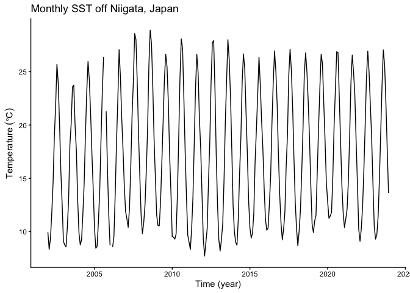
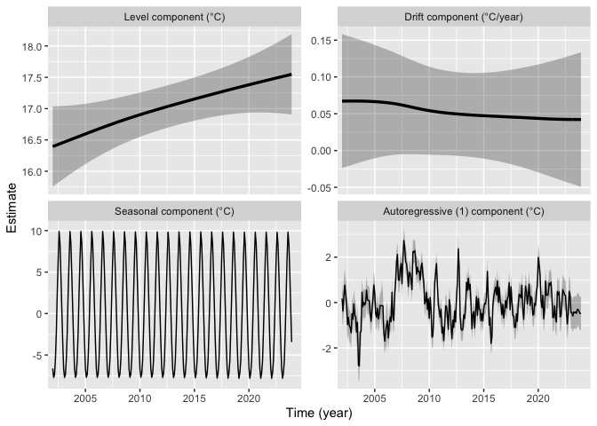
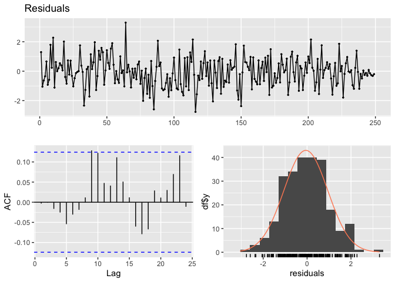

# Summary

R package **tempssm** provides tools for state-space analysis of
temperature time series, focusing on linear Gaussian state-space models
estimated via Kalman filtering and smoothing as implemented in the KFAS
package (Helske, 2017).

### Key features

- Designed for temperature time series with arbitrary seasonal
  frequencies; currently validated primarily on monthly data
- Estimates latent states using linear Gaussian state-space models
  combined with Kalman filtering and smoothing
- Models temperature dynamics as a sum of interpretable latent
  components, including a long-term trend, seasonal cycle,
  autoregressive structure, and optional exogenous effects
- Allows users to specify an arbitrary order of the autoregressive
  component (default: AR(1))
- Implements time-series cross-validation for model evaluation

# Prior Art and Scope

`tempssm` provides a domain-focused workflow for analyzing temperature
time series with linear Gaussian state-space models. It brings together
model construction, component extraction, uncertainty summaries,
residual diagnostics, visualization, and time-series cross-validation in
a single R package interface tailored to temperature applications.

The package builds on established statistical methodology, including
linear Gaussian state-space modeling, Kalman filtering, and Kalman
smoothing. Model estimation is handled through the `KFAS` package, which
provides a general framework for state-space models in R.

The initial implementation was adapted from the supplementary code
provided by Baba (2024), accompanying Baba et al. (2024), which analyzed
sea temperature trends using a linear Gaussian state-space model. The
supplementary code is publicly available at:

<https://github.com/logics-of-blue/sea-temperature-trend-jogashima>

Compared with that prior implementation, `tempssm` extends the workflow
into a reusable R package interface with input validation, documented S3
methods, tests, diagnostics, cross-validation utilities, and examples
for broader temperature time-series analysis.

The next section describes the state-space model used by `tempssm` and
clarifies how the trend, seasonal, autoregressive, and exogenous
components are represented.

# State-Space Model in **tempssm**

We consider an extended version of the Basic Structural Time Series
Model (BSTSM) to describe temperature time series with explicit
long-term trend, seasonal variability, and auto-regressive component.
The observation equation is given by
``` math
y_t = \alpha_t + v_t. \tag{1}
```
where $`t`$ denotes the time index, $`y_t`$ is the observed temperature,
$`\alpha_t`$ is the latent state, and $`v_t`$ is the observation error.

The latent state is decomposed as
``` math
\alpha_t = \mu_t + s_t + r_t + E_t. \tag{2}
```
where $`\mu_t`$ is the level (trend), $`s_t`$ the seasonal component,
$`r_t`$ a stationary autoregressive component, and $`E_t`$ the
contribution of exogenous variables.

The level component follows a second-order stochastic process:
``` math
\mu_t = 2\mu_{t-1} - \mu_{t-2} + \zeta_t,
\qquad \zeta_t \sim \mathcal{N}(0, \sigma_\zeta^2). \tag{3}
```
where $`\zeta_t`$ is the process error of the level component.

The seasonal component is modeled with a sum-to-zero constraint:
``` math
s_t = - \sum_{i=t-f}^{t-1} s_i + \omega_t,
\qquad \omega_t \sim \mathcal{N}(0, \sigma_\omega^2). \tag{4}
```
where $`\omega_t`$ is the process error of the seasonal component and
$`f`$ denotes the seasonal frequency (e.g., $`f=12`$ for monthly data).
This formulation ensures that seasonal effects are identifiable and
comparable across different temporal resolutions. By enforcing the
sum-to-zero constraint over one full seasonal cycle, the seasonal
component captures recurring deviations from the underlying trend
without introducing long-term drift. In models without a seasonal
component, the seasonal term $`s_t`$ is set to zero and omitted from the
satate equation.

The autoregressive component follows an $`l`$th-order autoregressive
(AR) process:
``` math
r_t = \phi_1 r_{t-1} + \phi_2 r_{t-2} + \cdots + \phi_l r_{t-l} + \tau_t,
\qquad \tau_t \sim \mathcal{N}(0, \sigma_\tau^2). \tag{5}
```
Here, $`\tau_t`$ denotes the process error of the autoregressive
component. The process error terms ($`\zeta_t`$, $`\omega_t`$, and
$`\tau_t`$) are assumed to be mutually independent and normally
distributed.

The exogenous component is defined as
``` math
E_t = \beta_1 x_{1,t} + \beta_2 x_{2,t} + \cdots + \beta_m x_{m,t}. \tag{6}
```
The exogenous term $`E_t`$ represents the influence of external factors,
which may include large-scale climate indices, regional environmental
variables, or other physically motivated predictors relevant to the
observed temperature time series. Each exogenous variable enters the
model linearly through a time-invariant regression coefficient
($`\beta_1, \beta_2, \ldots, \beta_m`$), allowing both the magnitude and
direction of its contribution to be estimated jointly with the latent
state components.

When applying the model to observational data, the total number of
parameters to be estimated ($`k`$) depends on the order of
autoregressive component and the number of exogenous variables included.
For example, in a model with a second-order autoregressive component and
no exogenous covariates, six parameters are estimated: the observation
error variance, the process error variances associated with the level,
seasonal, and autoregressive components, and the first- and second-order
autoregressive coefficients ($`\phi_1`$ and $`\phi_2`$). In the general
case with an $`l`$-order autoregressive component and $`m`$ exogenous
variables, a total number of parameters is $`k = 4 + l + m`$.

The core implementation of parameter estimation procedure is based on
the supplementary code provided by Baba et al. (2024). Parameter
estimation is performed using a two-step optimization strategy
recommended by Helske (2017). In the first step, model parameters are
estimated using the Nelder-Mead method (Nelder & Mead, 1965) with
user-specified initial values. The resulting estimates are then used as
initial values in a second optimization step based on the BFGS algorithm
(Shanno, 1970). The main model-fitting function, `tempssm()`, returns
both filtering and smoothing estimates. Unless otherwise stated, all
results presented in this vignette are based on the smoothed estimates.

# How to use

## Set Ennvironment

Load the following libraries for executing ‘How to use’.

``` r
## Set libraries
library(tempssm)
```

## Input Data Format

Input data for **tempssm** must be supplied as an R `ts` object, which
represents a regularly spaced time series (see `?stats::ts` or
<https://stat.ethz.ch/R-manual/R-devel/library/stats/html/ts.html>).

To support data preparation, the package includes utility functions that
convert external observational data into `ts` objects suitable for model
fitting (see Appendix).

## Practice: Applying State-Space Model to a Univariate Temperature Time Series

### Objective

The objective of this practice is to demonstrate the basic application
of a linear Gaussian state-space model to a univariate temperature time
series. This example serves as an introduction to the modeling framework
and highlights the role of autoregressive dynamics without the inclusion
of exogenous variables.

### Loading the Dataset

A sample sea surface temperature (SST) dataset is included in the
package.

- **Dataset**: Monthly sea surface temperature (SST) off Niigata, Japan\
- **Unit**: Degrees Celsius\
- **Period**: February 2002 to December 2023

This dataset is derived from observations archived at Japan
Oceanographic Data Center (JODC), Hydrographic and Oceanographic
Department, Japan Coast Guard. Original daily SST data were obtained
from <https://www.jodc.go.jp/jodcweb/JDOSS/index.html> and aggregated
into monthly means.

``` r
data(niigata_sst) # load a ts object of SST off Niigata
head(niigata_sst)
```

    ##            Jan       Feb       Mar       Apr       May       Jun
    ## 2002  9.951613  8.332143  9.348387 11.713333 14.529032 18.906667

``` r
summary(niigata_sst)
```

    ##       Temp       
    ##  Min.   : 7.707  
    ##  1st Qu.:11.217  
    ##  Median :16.345  
    ##  Mean   :17.033  
    ##  3rd Qu.:22.787  
    ##  Max.   :28.897  
    ##  NAs    :2

The dataset includes two missing observations. Even if missing
observations was in your dataset included, there are retained and
handled explicitly within the state-space modeling framework.

### Plotting the Monthly SST Time Series

We begin by visualizing the monthly SST time series to examine its
overall structure, including apparent trends, seasonal variability, and
missing observations.

``` r
plt_niigata_sst <- forecast::autoplot(niigata_sst) +
  ggplot2::labs(
    y = expression(Temperature ~ (degree * C)),
    x = "Time (year)"
  ) +
  ggplot2::ggtitle("Monthly SST off Niigata, Japan") +
  ggplot2::theme_classic()

plot(plt_niigata_sst)
```

<!-- -->

The overall mean SST is approximately 17 °C, and a clear seasonal
pattern is visible. The series contains two missing observations, in
September 2005 and February 2006. Although SST appears to be higher near
the end of the series than near the beginning, year-to-year variability
is also evident, making the long-term trend difficult to assess from the
raw time series alone.

### Applying a Linear Gaussian State-Space Model

When a ts object containing temperature time-series data (here,
`niigata_sst`) is passed to the core function tempssm(), model
construction and parameter estimation are performed together. The
returned S3 object of class tempssm (here, `res`) stores the filtering
and smoothing estimates, as well as the constructed model and input
data. By default, tempssm() fits a first-order autoregressive model.

``` r
# model with first-order autoregressive component
res <- tempssm(niigata_sst) # AR(1), the default model
summary(res)
```

    ## tempssm summary
    ## -----------------
    ## Call:
    ## tempssm(temp_data = niigata_sst)
    ## 
    ## Model fit:
    ##   Likelihood type: marginal 
    ##   Log-likelihood : -249.8 
    ##   k              : 5 
    ##   Diffuse states : 13 
    ##   Converged      : TRUE 
    ## 
    ## Variance parameters:
    ##   Observation (H): 0.005985637 
    ##   State (Q trend): 1.268117e-07 
    ##   State (Q season): 0.001346138 
    ##   State (Q ar): 0.4097883 
    ## 
    ## Components of auto-regression:
    ##   Order of AR: 1 
    ##   Coefficient of AR1: 0.7442999

From the summary output, confirm that the model has converged
(Converged: TRUE). The output also reports statistics such as the number
of parameters (k), the log-likelihood, the likelihood type, and the
number of diffuse initial states. The parameter estimates include the
observation error variance (H), the process error variance of the
long-term trend component (Q trend), the process error variance of the
seasonal component (Q season), the process error variance of the
autoregressive component, and the first-order autoregressive coefficient
(AR1).

The log-likelihood and the associated number of estimated parameters can
also be extracted directly from the fitted `tempssm` object using
`logLik()`.

``` r
ll <- logLik(res)
ll
```

    ## 'log Lik.' -249.7962 (df=5)

``` r
attr(ll, "df") # number of parameters
```

    ## [1] 5

By default, `tempssm()` uses the KFAS marginal likelihood for parameter
estimation. The selected likelihood type is retained for `logLik()` and
`summary()`. The package intentionally does not compute AIC for
`tempssm` objects. The log-likelihood and parameter count remain
available through `logLik()` for users who need them for their own
model-assessment workflows. The diffuse likelihood remains available by
fitting the model with `marginal = FALSE`.

### Plotting Level, Drift, Seasonal, and Auto-Regressive Components

We visualize the estimated long-term evolution of temperature levels and
their rates of change (drift) by extracting the corresponding latent
components from the state-space model. Additionally, seasonal
variability and autoregressive dependence are plotted out, allowing the
underlying trend behavior to be examined more clearly.

``` r
# plot all components at once
plot(res)
```

<!-- -->

The level component shows a persistent upward trend in sea surface
temperature over the study period, while the drift component indicates a
relatively stable positive rate of change. The shaded gray areas
represent 95% confidence intervals for the estimated latent states,
illustrating the uncertainty associated with each of estimated
components.

Although the observed time series contains missing values, the
state-space framework allows latent states to be estimated for the
entire time span, including unobserved periods.

The standard plotting interface is `plot(res)`. The ggplot2-style
interface `autoplot(res)` is also available and produces the same
component plot by default. It returns a faceted `ggplot` object, so
selected components can be stored and customized with standard ggplot2
layers, for example,
`autoplot(res, component = c("level", "drift")) + ggplot2::theme_bw()`.

### Simple Model Diagnostics

The package provides diagnostic tools for checking whether the fitted
model has left notable structure in the residuals. In particular,
residual time-series plots, residual autocorrelation, residual
distributions, and Ljung-Box tests can be used to assess remaining
temporal dependence and departures from the Gaussian error assumption.

``` r
plot_tempssm_residual_diagnostics(res)
```

<!-- -->

In the model diagnostic plot, the upper panel shows the residual time
series, the lower-left panel shows the residual autocorrelation plot
(ACF plot), and the lower-right panel shows the residual frequency
distribution. These plots should be checked for any notable residual
patterns.

``` r
diag <- diagnose_residuals(res)
print(diag)
```

    ## # A tibble: 1 × 4
    ##   lb_stat lb_lag lb_pvalue kurtosis
    ##     <dbl>  <dbl>     <dbl>    <dbl>
    ## 1    10.7     12     0.558     3.06

The `lb_stat`, `lb_lag`, and `lb_pvalue` columns correspond to the
Ljung-Box test statistic, the lag used in the test, and its P-value,
respectively. For monthly time series, `diagnose_residuals()` uses lag
12 by default. In this example, the Ljung-Box test indicated no
significant residual autocorrelation up to lag 12 (P \> 0.05).

### Estimated Parameters and Latent-State Components

The long-term trend component and its rate of change (drift) can be
extracted as ts objects as follows.

``` r
# Smoothing estimates
alpha_hat <- res$kfs$alphahat
head(alpha_hat)
```

    ##            level       slope sea_dummy1 sea_dummy2 sea_dummy3 sea_dummy4
    ## Jan 2002 16.3944 0.005600279  -6.624679  -3.337435  0.6067453  4.7593086
    ## Feb 2002 16.4000 0.005600420  -7.676822  -6.624679 -3.3374348  0.6067453
    ## Mar 2002 16.4056 0.005600414  -7.346316  -7.676822 -6.6246785 -3.3374348
    ## Apr 2002 16.4112 0.005600310  -5.476554  -7.346316 -7.6768220 -6.6246785
    ## May 2002 16.4168 0.005600334  -2.217000  -5.476554 -7.3463157 -7.6768220
    ## Jun 2002 16.4224 0.005600466   2.468021  -2.217000 -5.4765545 -7.3463157
    ##          sea_dummy5 sea_dummy6 sea_dummy7 sea_dummy8 sea_dummy9 sea_dummy10
    ## Jan 2002  8.5280151  9.9007960  6.4159192  2.4680212  -2.217000   -5.476554
    ## Feb 2002  4.7593086  8.5280151  9.9007960  6.4159192   2.468021   -2.217000
    ## Mar 2002  0.6067453  4.7593086  8.5280151  9.9007960   6.415919    2.468021
    ## Apr 2002 -3.3374348  0.6067453  4.7593086  8.5280151   9.900796    6.415919
    ## May 2002 -6.6246785 -3.3374348  0.6067453  4.7593086   8.528015    9.900796
    ## Jun 2002 -7.6768220 -6.6246785 -3.3374348  0.6067453   4.759309    8.528015
    ##          sea_dummy11      arima1
    ## Jan 2002   -7.346316  0.17523167
    ## Feb 2002   -5.476554 -0.37744125
    ## Mar 2002   -2.217000  0.28684018
    ## Apr 2002    2.468021  0.76796641
    ## May 2002    6.415919  0.33018674
    ## Jun 2002    9.900796  0.00904254

``` r
# 　Smoothing estimate of level component
level_ts <- get_level_ts(res)

# 　Smoothing estimate of drift component
drift_ts <- get_drift_ts(res)

# Average drift rate per year across the full period
mean_drift_year <- mean(drift_ts)
print(mean_drift_year)
```

    ## [1] 0.05259212

Average annual increase in SST is approximately 0.05 °C.

### Short-Term Prediction

A fitted `tempssm` object can also be passed to `predict()` to obtain
short-term predictions. By default, `predict(res)` returns a
one-step-ahead prediction beyond the end of the observed series. This is
useful for visual checks of how the fitted model extrapolates the
estimated level, seasonal, and autoregressive components.

``` r
pred_1 <- predict(res)
pred_1
```

    ##           Jan
    ## 2024 10.61997

Predictions for multiple future time points can be requested by setting
the `n.ahead` argument.

``` r
pred_12 <- predict(res, n.ahead = 12)
pred_12
```

    ##            Jan       Feb       Mar       Apr       May       Jun       Jul
    ## 2024 10.619966  9.500226 10.198500 11.757055 15.414159 19.704126 24.218777
    ##            Aug       Sep       Oct       Nov       Dec
    ## 2024 27.331048 25.941035 22.395225 18.262379 14.141777

These predictions should be interpreted as model-based extrapolations
rather than definitive forecasts. Uncertainty generally increases as the
prediction horizon becomes longer, and long-horizon predictions can be
sensitive to model assumptions about trend, seasonality, and
autoregressive dependence.

The examples above illustrate the basic univariate workflow for fitting,
diagnosing, visualizing, and making short-term predictions from a
`tempssm` model. The detailed manual extends this workflow to exogenous
variables, additional model diagnostics, and time-series
cross-validation:

<https://github.com/akihirao/tempssm/blob/main/tools/manual/tempssm_manual.pdf>
