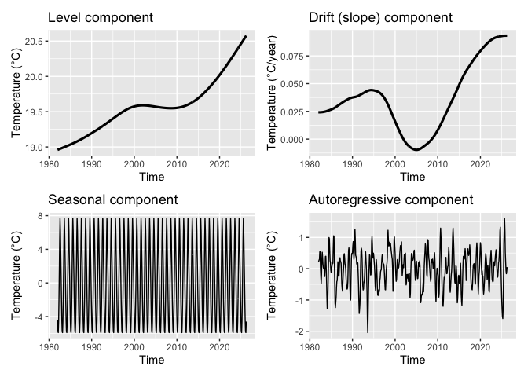
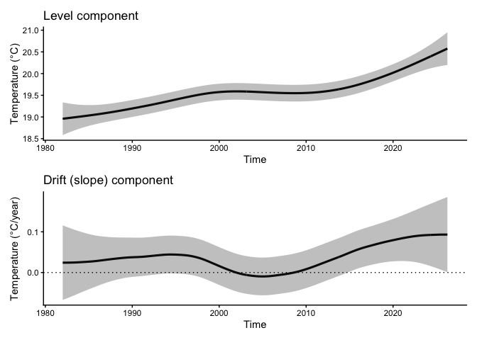
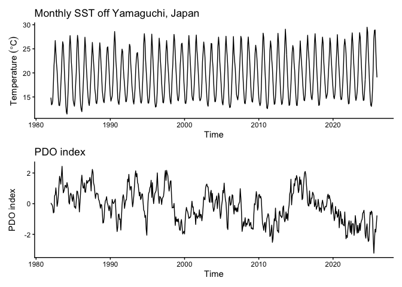
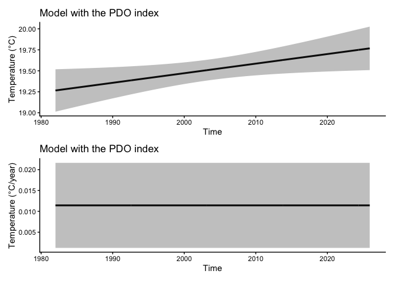
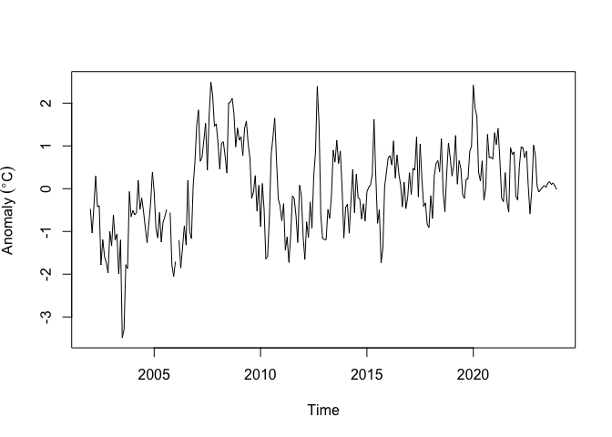

R package **tempssm** provides tools for state-space analysis of
temperature time series. It provides tools for fitting linear Gaussian
state-space models and conducting inference via Kalman filtering and
smoothing, implemented using the KFAS R package (Helske, 2017).

## Key features

- Designed for temperature time series with arbitrary seasonal
  frequencies; currently validated primarily on monthly data
- Estimates latent states using linear Gaussian state-space models
  combined with Kalman filtering and smoothing
- Models temperature dynamics as a sum of interpretable latent
  components, including a long-term trend, seasonal cycle,
  autoregressive structure, and optional exogenous effects
- Allows users to specify an arbitrary order of the autoregressive
  component (default: AR(1))
- Implements time-series cross-validation for model evaluation

## Input Data Format

Input data for **tempssm** must be supplied as an R `ts` object, which
represents a regularly spaced time series (see `?stats::ts` or
<https://stat.ethz.ch/R-manual/R-devel/library/stats/html/ts.html>).

To support data preparation, the package includes utility functions that
convert external observational data into `ts` objects suitable for model
fitting (see Appendix).

## To Install

``` r
if(!require("devtools"))
    install.packages("devtools")
devtools::install_github("akihirao/tempssm")
```

## Set Ennvironment for Practices

``` r
## Set libraries
library(tempssm)
library(forecast)

library(purrr) 
library(tibble)
library(readr)
library(dplyr)
library(ggplot2)

library(future)
library(parallelly)

has_future <- requireNamespace("future", quietly = TRUE)

if (has_future) {
  if (future::nbrOfWorkers() == 1) {

    # minimqnized setting for vignette
    workers <- min(2, future::availableCores())

    if (future::supportsMulticore()) {
      future::plan(future::multicore, workers = workers)
    } else {
      future::plan(future::multisession, workers = workers)
    }

  }
} else {
  message("future not available; running sequentially")
}
```

## Practice I: Applying a Linear Gaussian State-Space Model

## to a Univariate Temperature Time Series

### Objective

The objective of this practice is to demonstrate the basic application
of a linear Gaussian state-space model to a univariate temperature time
series. This example serves as an introduction to the modeling framework
and highlights the role of autoregressive dynamics without the inclusion
of exogenous variables.

### Loading the Dataset

A sample sea surface temperature (SST) dataset is included in the
package.

- **Dataset**: Monthly sea surface temperature (SST) off Yamaguchi
  Prefecture, Japan  
- **Unit**: Degrees Celsius  
- **Period**: February 2002 to December 2023  
  \`\`

This dataset is derived from observations archived at Japan
Meteorological Agency (JMA). Data obtained from the JMA website:
<https://www.jma.go.jp/jma/indexe.html>

``` r
data(yamaguchi_sst) # load a ts object of SST off Niigata
head(yamaguchi_sst)
```

    ##           Jan      Feb      Mar      Apr      May      Jun
    ## 1982 14.85516 13.36500 13.55645 14.29933 17.72419 21.53000

``` r
summary(yamaguchi_sst)
```

    ##       Temp      
    ##  Min.   :11.45  
    ##  1st Qu.:15.13  
    ##  Median :18.84  
    ##  Mean   :19.54  
    ##  3rd Qu.:23.63  
    ##  Max.   :29.49

The dataset includes no missing observations. Even if missing
observations was included, there are retained and handled explicitly
within the state-space modeling framework.

### Plotting the Monthly SST Time Series

We begin by visualizing the monthly SST time series to examine its
overall structure, including apparent trends, seasonal variability, and
missing observations.

``` r
plt_yamaguchi_sst <- forecast::autoplot(yamaguchi_sst) +
  labs(y = expression(Temperature~(degree*C)), 
       x = "Time") +
  ggtitle("Monthly SST off Yamaguchi, Japan") +
  theme_classic()

plot(plt_yamaguchi_sst)
```

<!-- -->

### Applying a Linear Gaussian State-Space Model

Here, we apply linear Gaussian state-space models to the univariate SST
time series and examine the effect of the autoregressive (AR) order on
model behavior.  
Specifically, three models are fitted with the order of the
autoregressive component varying from 1 to 3, while all other model
components, including the explicit seasonal cycle, are kept the same.

By comparing models with different AR orders, we assess how short- and
longer-term temporal dependencies are represented within the state-space
framework.  
The model summaries provide parameter estimates and diagnostics that can
be used to evaluate the adequacy of different autoregressive orders.
Model comparison and selection are discussed in the following section.

``` r
# model with first-order autoregressive component
res <- tempssm(yamaguchi_sst) # first order of auto-regressive model (ar_order=1: default)
summary(res)
```

    ## tempssm summary
    ## -----------------
    ## Call:
    ## tempssm(temp_data = yamaguchi_sst)
    ## 
    ## Model fit:
    ##   Log-likelihood : -470.61 
    ##   k              : 5 
    ##   AIC            : 951.21 
    ##   Converged      : TRUE 
    ## 
    ## Variance parameters:
    ##   Observation (H): 1.890233e-13 
    ##   State (Q trend): 9.936506e-08 
    ##   State (Q season): 4.135766e-53 
    ##   State (Q ar): 0.3145626 
    ## 
    ## Components of auto-regression:
    ##   Order of AR: 1 
    ##   Coefficient of AR1: 0.620232

``` r
# model with second-order autoregressive component
res_ar2 <- tempssm(yamaguchi_sst,ar_order=2) 
summary(res_ar2)
```

    ## tempssm summary
    ## -----------------
    ## Call:
    ## tempssm(temp_data = yamaguchi_sst, ar_order = 2)
    ## 
    ## Model fit:
    ##   Log-likelihood : -467.66 
    ##   k              : 6 
    ##   AIC            : 947.33 
    ##   Converged      : TRUE 
    ## 
    ## Variance parameters:
    ##   Observation (H): 0.1209081 
    ##   State (Q trend): 2.20625e-07 
    ##   State (Q season): 3.672084e-16 
    ##   State (Q ar): 0.1044201 
    ## 
    ## Components of auto-regression:
    ##   Order of AR: 2 
    ##   Coefficient of AR1: 1.185819 
    ##   Coefficient of AR2: -0.4790532

``` r
# model with third-order autoregressive component
res_ar3 <- tempssm(yamaguchi_sst,ar_order=3) 
summary(res_ar3)
```

    ## tempssm summary
    ## -----------------
    ## Call:
    ## tempssm(temp_data = yamaguchi_sst, ar_order = 3)
    ## 
    ## Model fit:
    ##   Log-likelihood : -467.5 
    ##   k              : 7 
    ##   AIC            : 949 
    ##   Converged      : TRUE 
    ## 
    ## Variance parameters:
    ##   Observation (H): 0.1123195 
    ##   State (Q trend): 2.24258e-07 
    ##   State (Q season): 8.435308e-10 
    ##   State (Q ar): 0.1245958 
    ## 
    ## Components of auto-regression:
    ##   Order of AR: 3 
    ##   Coefficient of AR1: 1.074592 
    ##   Coefficient of AR2: -0.3334564 
    ##   Coefficient of AR3: -0.06336912

### Model selection based on AIC

``` r
# Extract AIC
AIC_ar1 <- extract_AIC(res)
AIC_ar2 <- extract_AIC(res_ar2)
AIC_ar3 <- extract_AIC(res_ar3)

AIC_table_res <- tibble(model=c("AR1","AR2","AR3"),
                        AIC = c(AIC_ar1,AIC_ar2,AIC_ar3)) %>% 
  mutate(delta_AIC = AIC - min(AIC))

AIC_table_res %>% knitr::kable()
```

| model |      AIC | delta_AIC |
|:------|---------:|----------:|
| AR1   | 951.2127 |  3.884414 |
| AR2   | 947.3283 |  0.000000 |
| AR3   | 949.0037 |  1.675464 |

AR2 model is better than the other models.

### Plotting Level, Drift, Seasonal, and Auto-Regressive Components

``` r
# plot each of components at once
plot(res_ar2)
```

<!-- -->

### Simple Model Diagnostics

``` r
resid_test_output <- tempssm::wrapper_checkresiduals(res_ar2)
```

<!-- -->

``` r
print(resid_test_output)
```

    ## $Ljung_Box
    ## 
    ##  Box-Ljung test
    ## 
    ## data:  std_obs_resid
    ## X-squared = 24.004, df = 24, p-value = 0.4614
    ## 
    ## 
    ## $kurtosis
    ## [1] 3.661688

Autocorrelation of residuals was not significant by Ljung-Box test (P \>
0.05).

### Estimated Parameters and Components

``` r
# Smoothing estimates
alpha_hat <- res_ar2$kfs$alphahat
head(alpha_hat)
```

    ##             level       slope sea_dummy1 sea_dummy2 sea_dummy3 sea_dummy4
    ## Jan 1982 18.95931 0.002015928  -4.388281  -1.989806  0.8433008  3.3260566
    ## Feb 1982 18.96132 0.002016067  -5.783414  -4.388281 -1.9898060  0.8433008
    ## Mar 1982 18.96334 0.002016258  -5.905548  -5.783414 -4.3882811 -1.9898060
    ## Apr 1982 18.96536 0.002016898  -4.594205  -5.905548 -5.7834141 -4.3882811
    ## May 1982 18.96737 0.002017330  -1.902724  -4.594205 -5.9055484 -5.7834141
    ## Jun 1982 18.96939 0.002017773   1.458513  -1.902724 -4.5942046 -5.9055484
    ##          sea_dummy5 sea_dummy6 sea_dummy7 sea_dummy8 sea_dummy9 sea_dummy10
    ## Jan 1982  6.1502216  7.6638746  5.1220111  1.4585130  -1.902724   -4.594205
    ## Feb 1982  3.3260566  6.1502216  7.6638746  5.1220111   1.458513   -1.902724
    ## Mar 1982  0.8433008  3.3260566  6.1502216  7.6638746   5.122011    1.458513
    ## Apr 1982 -1.9898060  0.8433008  3.3260566  6.1502216   7.663875    5.122011
    ## May 1982 -4.3882811 -1.9898060  0.8433008  3.3260566   6.150222    7.663875
    ## Jun 1982 -5.7834141 -4.3882811 -1.9898060  0.8433008   3.326057    6.150222
    ##          sea_dummy11    arima1      arima2
    ## Jan 1982   -5.905548 0.2080997 -0.06449092
    ## Feb 1982   -4.594205 0.2341012 -0.09969084
    ## Mar 1982   -1.902724 0.2821581 -0.11214693
    ## Apr 1982    1.458513 0.2875607 -0.13516876
    ## May 1982    5.122011 0.5397161 -0.13775686
    ## Jun 1982    7.663875 0.5449232 -0.25855271

``` r
#　Smoothing estimate of level component
level_ts <- tempssm::extract_level_ts(res_ar2)

#　Smoothing estimate of drift component
drift_ts <- tempssm::extract_drift_ts(res_ar2)

# Average drift rate per year across the full period
mean_drift_year <- mean(drift_ts) 
print(mean_drift_year)
```

    ## [1] 0.03663452

``` r
# Average drift rate per year during 1980s
ave_drift_1980s <- window(drift_ts,
                          start=c(1982,1),
                          end=c(1990,12)
                          ) %>%  mean()
print(ave_drift_1980s)
```

    ## [1] 0.03048294

``` r
# Average drift rate per year during 1990s
ave_drift_1990s <- window(drift_ts,
                          start=c(1991,1),
                          end=c(2000,12)
                               ) %>%  mean()
print(ave_drift_1990s)
```

    ## [1] 0.03524637

``` r
# Average drift rate per year during 2000s
ave_drift_2000s <- window(drift_ts,
                          start=c(2001,1),
                          end=c(2009,12)
                               ) %>%  mean()
print(ave_drift_2000s)
```

    ## [1] -0.003607836

``` r
# Average drift rate per year during 2010s
ave_drift_2010s <- window(drift_ts,
                          start=c(2011,1),
                          end=c(2019,12)
                               ) %>%  mean()
print(ave_drift_2010s)
```

    ## [1] 0.05043439

``` r
# Average drift rate per year during 2020s
ave_drift_2020s <- window(drift_ts,
                          start=c(2021,1),
                          end=c(2025,12)
                               ) %>%  mean()
print(ave_drift_2020s)
```

    ## [1] 0.09035023

### Plotting Level and Drift Components with 95% Confidence Interval

We visualize the estimated long-term evolution of temperature levels and
their rates of change (drift) by extracting the corresponding latent
components from the state-space model. Seasonal variability and
autoregressive dependence are separated out, allowing the underlying
trend behavior to be examined more clearly.

``` r
plt_level_ci <- plot(res_ar2,
                     components = "level",
                     ci = TRUE,
                     ci_level = 0.95
                     ) +
  theme_classic()

plt_drift_ci <- plot(res_ar2,
                     components = "drift",
                     ci = TRUE,
                     ci_level = 0.95
                     ) +
  geom_hline(yintercept = 0, lty="dotted") +
  theme_classic()


plt_level_drift_ci <- plt_level_ci + plt_drift_ci + patchwork::plot_layout(ncol=1)

plot(plt_level_drift_ci)
```

<!-- -->

The level component shows a persistent upward trend in sea surface
temperature over the study period. The drift component indicates a
relatively stable positive rate of change, with an estimated average
annual increase of approximately 0.0525 °C. The shaded gray areas
represent 95% confidence intervals for the estimated latent states,
illustrating the uncertainty associated with the inferred long-term
trend and its rate of change.

## Practice II: Applying a Linear Gaussian State-Space Model

## to a Temperature Time Series with an Exogenous Variable

### Objective

The objective of this practice is to investigate and quantify the
influence of a large-scale climate mode on temperature variations.
Specifically, we examine the effect of the Pacific Decadal Oscillation
(PDO) as an exogenous variable on SST observed off Yamaguchi Prefecture,
Japan, within a state-space modeling framework.

### Loading Dataset: PDO Index as an Exogenous Variable

- **Data**: Monthly Pacific Decadal Oscillation (PDO) index (JMA)  
- **Period**: January 1901 to December 2025

The Pacific Decadal Oscillation (PDO) index is defined as the projection
of monthly mean sea surface temperature (SST) anomalies onto the leading
empirical orthogonal function (EOF) of SST variability over the North
Pacific north of 20°N. The EOF is computed using SST anomalies for
1901–2000, defined relative to the 1901–2000 monthly climatology. To
remove the global warming signal, the global-mean SST anomaly is
subtracted from each grid point prior to the EOF analysis. In this
package, we use the PDO index provided by the Japan Meteorological
Agency (JMA), available at
<https://www.data.jma.go.jp/kaiyou/data/shindan/b_1/pdo/pdo.txt>.

``` r
data(pdo) # load a ts object of NAO index
head(pdo)
```

    ##          Jan     Feb     Mar     Apr     May     Jun
    ## 1901  1.0040  0.7403  0.9011 -0.0109 -0.2325 -0.6810

### Intersecting the Temperature and PDO Time Series

For state-space modeling with exogenous variables, all input time series
must share a common and aligned time index. In this step, the
temperature and PDO time series are restricted to their overlapping
period by trimming the leading and trailing portions, ensuring that both
datasets cover an identical time span.

The function `tempssm::trim_ts_overlap()` is used to align the two `ts`
objects on a shared timeline, returning a multivariate time series
containing only the common period.

``` r
# Generate an object on a shared timeline
yamaguchi_sst_trim <- trim_ts_overlap(yamaguchi_sst,
                                      pdo,
                                      temp_name = "Temp",
                                      exo_name="PDO")$temperature


pdo_trim <- trim_ts_overlap(yamaguchi_sst,
                            pdo,
                            temp_name = "Temp",
                            exo_name="PDO")$exogenous

start(yamaguchi_sst_trim)
```

    ## [1] 1982    1

``` r
end(yamaguchi_sst_trim)
```

    ## [1] 2025   12

``` r
start(pdo_trim)
```

    ## [1] 1982    1

``` r
end(pdo_trim)
```

    ## [1] 2025   12

### Plotting Time Series of Air Temperature and NAO Index

``` r
plt_yamaguchi_sst_trim <- forecast::autoplot(yamaguchi_sst_trim) +
  labs(y = expression(Temperature~(degree*C)), 
       x = "Time") +
  ggtitle("Monthly SST off Yamaguchi, Japan") +
  theme_classic()


plt_pdo <- forecast::autoplot(pdo_trim) +
  labs(x = "Time", y = "PDO index") +
  ggtitle("PDO index") +
  theme_classic()

plt_yamaguchi_sst_trim + plt_pdo + patchwork::plot_layout(ncol=1)
```

<!-- -->

### Applying a Model Without an Exogenous Variable

We first fit a baseline state-space model that does not include any
exogenous variables. This model serves as a reference case in which
temperature variability is explained solely by the latent trend,
seasonal cycle, and autoregressive dependence.

``` r
res_without <- tempssm(yamaguchi_sst_trim,ar=2) 
summary(res_without)
```

    ## tempssm summary
    ## -----------------
    ## Call:
    ## tempssm(temp_data = yamaguchi_sst_trim, ar_order = 2)
    ## 
    ## Model fit:
    ##   Log-likelihood : -466.08 
    ##   k              : 6 
    ##   AIC            : 944.17 
    ##   Converged      : TRUE 
    ## 
    ## Variance parameters:
    ##   Observation (H): 0.1207592 
    ##   State (Q trend): 2.163326e-07 
    ##   State (Q season): 2.910014e-13 
    ##   State (Q ar): 0.1071189 
    ## 
    ## Components of auto-regression:
    ##   Order of AR: 2 
    ##   Coefficient of AR1: 1.178246 
    ##   Coefficient of AR2: -0.4720562

The fitted model converges successfully and includes a first-order
autoregressive \[AR(1)\] component. Prior testing of autoregressive
orders from AR(1) to AR(3) indicated that AR(1) provided the best model
fit for both the baseline model and the model including the exogenous
PDO index. For brevity, the detailed results of this comparison are
omitted here; interested users are encouraged to explore alternative AR
orders within their own analyses.

This baseline model provides a useful benchmark for evaluating the
additional explanatory power of the PDO index introduced in the
following section.

### Applying Model With an Exogenous Variable

``` r
res_with <- tempssm(temp_data = yamaguchi_sst_trim,
                    exo_data = pdo_trim,
                    ar_order = 2) 
summary(res_with)
```

    ## tempssm summary
    ## -----------------
    ## Call:
    ## tempssm(temp_data = yamaguchi_sst_trim, exo_data = pdo_trim, 
    ##     ar_order = 2)
    ## 
    ## Model fit:
    ##   Log-likelihood : -427.33 
    ##   k              : 7 
    ##   AIC            : 868.65 
    ##   Converged      : TRUE 
    ## 
    ## Variance parameters:
    ##   Observation (H): 0.05748997 
    ##   State (Q trend): 3.864314e-19 
    ##   State (Q season): 1.610093e-54 
    ##   State (Q ar): 0.1792553 
    ## 
    ## Components of auto-regression:
    ##   Order of AR: 2 
    ##   Coefficient of AR1: 0.8656252 
    ##   Coefficient of AR2: -0.1615365 
    ## Exogenous variable    PDO 
    ## Estimated coefficient     -0.4406609 
    ## Lower CI  -0.5296035 
    ## Upper CI  -0.3517183

The estimated coefficient for the exogenous PDO index is negative
(-0.44), and its 95% confidence interval does not include zero
``` math
-0.53,
-0.35
```
, indicating a statistically significant relationship between local SST
off Yamaguchi Prefecture and the PDO variability.

Specifically, the model suggests that a one-unit increase in the PDO
index is associated with an average decrease of approximately 0.44 °C in
monthly SST, after accounting for the underlying trend, seasonal cycle,
and autoregressive dependence. This result implies that positive phases
of the PDO contribute systematically to cooler temperature conditions at
the study site.

Importantly, this effect is identified in addition to the internal
dynamics of the temperature time series, rather than being an artifact
of an improved representation of the trend or temporal dependence.
Compared with the baseline model without exogenous variables, the
statistical significance of the PDO coefficient indicates that the PDO
acts as an independent large-scale climate driver influencing local
temperature variability.

We next compare the overall goodness of fit between the two models using
the Akaike Information Criterion (AIC).

### Model comparison based on AICs

Model selection criteria such as the AIC provide a quantitative measure
of model adequacy that balances goodness of fit against model
complexity. Lower AIC values indicate a more parsimonious model with
better support from the data.

``` r
AIC_without <- extract_AIC(res_without)
AIC_with <- extract_AIC(res_with)

models_AICs <- tibble(
  model = c("Without","With"),
  AIC = c(AIC_without,AIC_with),
  delta_AIC = min(AIC)-AIC
  )

models_AICs %>% knitr::kable()
```

| model   |      AIC | delta_AIC |
|:--------|---------:|----------:|
| Without | 944.1678 | -75.51744 |
| With    | 868.6503 |   0.00000 |

The model including the PDO index as an exogenous variable exhibits a
substantially lower AIC than the baseline model without exogenous
variables, indicating a markedly better overall fit. This result
supports the conclusion that explicitly accounting for NAO variability
improves the statistical description of the temperature time series
beyond what is achieved by internal dynamics alone.

It should be noted that AIC-based comparisons are meaningful only among
models fitted to the same time series over an identical period.
Moreover, in state-space models, AIC differences reflect both regression
effects and changes in the stochastic structure of latent components.
Therefore, AIC should be used as a complementary diagnostic alongside
parameter estimates and their uncertainty, rather than as a sole basis
for inference.

To further assess the robustness and predictive performance of the
models, we employ time-series cross-validation as described bellow.

### Plotting Level and Drift Components with 95% CI

``` r
plt_level_without_ts <- plot(res_without, 
                             components=c("level"),
                             ci=TRUE) +
  labs(title="Model without the PDO index") +
  theme_classic()

plt_drift_without_ts <- plot(res_without, 
                             components=c("drift"),
                             ci=TRUE) + 
  labs(title="Model without the PDO index") +
  theme_classic()

plt_level_drift_without_ts <- plt_level_without_ts + 
  plt_drift_without_ts + 
  patchwork::plot_layout(ncol=1)

plot(plt_level_drift_without_ts)
```

<!-- -->

``` r
plt_level_with_ts <- plot(res_with,
                          components=c("level"),
                          ci=TRUE)+ 
  labs(title="Model with the PDO index") +
  theme_classic()

plt_drift_with_ts <- plot(res_with,
                          components=c("drift"),
                          ci=TRUE) + 
  labs(title="Model with the PDO index") + 
  theme_classic()

plt_level_drift_with_ts <- plt_level_with_ts + 
  plt_drift_with_ts + 
  patchwork::plot_layout(ncol=1)

plot(plt_level_drift_with_ts)
```

<!-- -->

Gray areas in the above graph show 95% confidence interval.

### Time Series Cross-Validation (tsCV)

Time series cross-validation (tsCV) approach evaluates model performance
based on out-of-sample prediction errors while respecting the temporal
ordering of the data, and thus provides an additional, independent
perspective on model adequacy.

Time-series cross-validation is conducted by repeatedly fitting the
model to an expanding training window and evaluating its predictive
performance on subsequent observations. Unlike random cross-validation,
this procedure avoids information leakage from the future to the past
and is therefore well suited for temporal data.

By comparing cross-validation metrics for models with and without the
exogenous PDO variable, we assess whether the improvement suggested by
AIC is also reflected in out-of-sample predictive skill.

``` r
# ts cross-validation of the model without exogenous variables

## Generate a list of training and test datasets with their indices
# Procedure for constructing year-based time-series cross-validation folds:
# 
# First training data: January 1982–December 2017;
# First test data: one year starting from January 2018
# 
# Second training data: January 1875–December 1960;
# Second test data: one year starting from January 1961
# ...
# 
# Eighth training data: January 1875–December 2020;
# Eighth test data: one year starting from January 2021
#
# These folds are automatically generated by the ts_cv_folds() function.
# Generate training and test dataset

folds_without <- ts_cv_folds(
  temp_data = yamaguchi_sst_trim,
  exo_data = NULL,
  initial = 432, # 1032 monthly observations from Jan 1865 to Dec 1950
  horizon = 12, # forecast 12 monthly time-series
  step = 12, # training data is moved by 12 months (1 years) steps
  fixed_window = FALSE,
  allow_partial = FALSE
  )

folds_with <- ts_cv_folds(
  temp_data = yamaguchi_sst_trim,
  exo_data = pdo_trim,
  initial = 432, # 1032 monthly observations from Jan 1865 to Dec 1950
  horizon = 12, # forecast 12 monthly time-series
  step = 12, # training data is moved by 12 months (10 years) steps
  fixed_window = FALSE,
  allow_partial = FALSE
  )

## Performe tsCV for the model without the exogenous variable of NAO
cv_meta_without <- rolling_origin_tsCV(folds_without,
                                       fold_ids=seq(1:8), 
                                       ar_order=1) 
# Hold on a few minutes 

cv_without <- map(cv_meta_without, pluck, "CV", .default = NULL)

cv_without_tidy <- cv_without %>%
  map(~ as.data.frame(.x) %>%tibble::rownames_to_column(var = "set")) %>%
  purrr::list_rbind(names_to = "cv_id") %>%
  mutate(Model="Without") %>%
  dplyr::relocate(Model,cv_id, set)  # 識別列を先頭に

print(cv_without_tidy)
```

    ##     Model cv_id      set           ME      RMSE       MAE        MPE     MAPE
    ## 1 Without fold1 Test set -0.082131309 0.3968985 0.3368543 -0.6841675 1.882836
    ## 2 Without fold2 Test set  0.274628719 0.6472397 0.5268065  1.8561485 2.914802
    ## 3 Without fold3 Test set  0.003464786 0.5533610 0.5193769  0.2777597 2.682239
    ## 4 Without fold4 Test set  0.289903864 0.5411872 0.4636516  1.5656503 2.388918
    ## 5 Without fold5 Test set  0.169223387 0.5748575 0.4548490  0.3943817 2.360390
    ## 6 Without fold6 Test set  0.526716069 0.6843648 0.5831273  2.3731460 2.742728
    ## 7 Without fold7 Test set  0.649569786 1.0016343 0.7400788  2.5704196 3.132720
    ## 8 Without fold8 Test set  0.290709682 1.3687556 1.1917132 -0.2547193 5.973012
    ##         ACF1 Theil's U MASE_naive MASE_snaive
    ## 1 0.31737585 0.1719900  0.1489075   0.4387554
    ## 2 0.46104334 0.3501850  0.2327077   0.6897065
    ## 3 0.22048884 0.2126665  0.2300251   0.6797621
    ## 4 0.01973158 0.2653134  0.2052778   0.6082287
    ## 5 0.59652583 0.2311136  0.2017504   0.5968111
    ## 6 0.32786740 0.2733864  0.2581054   0.7720604
    ## 7 0.52516266 0.3170262  0.3273829   0.9867860
    ## 8 0.69684921 0.4633858  0.5254662   1.6067073

``` r
## Performe tsCV for the model with the exogenous variable of NAO
cv_meta_with <- rolling_origin_tsCV(folds_with,
                                    fold_ids=seq(1:8),
                                    ar_order=1)
# Hold on a few minutes 

cv_with <- map(cv_meta_with, pluck, "CV", .default = NULL)


cv_with_tidy <- cv_with %>%
  map(~ as.data.frame(.x) %>%tibble::rownames_to_column(var = "set")) %>%
  purrr::list_rbind(names_to = "cv_id") %>%
  mutate(Model="With") %>%
  dplyr::relocate(Model,cv_id, set)  # Reorder columns to place identifier variables first

print(cv_with_tidy)
```

    ##   Model cv_id      set          ME      RMSE       MAE        MPE     MAPE
    ## 1  With fold1 Test set -0.49171398 0.6209634 0.5067416 -2.8574194 2.916676
    ## 2  With fold2 Test set  0.19570225 0.6097237 0.5165839  1.4370289 2.789247
    ## 3  With fold3 Test set -0.61575251 0.8445650 0.7097614 -2.9638975 3.540828
    ## 4  With fold4 Test set -0.07627415 0.4111311 0.3429435 -0.2349414 1.730350
    ## 5  With fold5 Test set -0.14535379 0.4431122 0.3898476 -1.1328844 2.133973
    ## 6  With fold6 Test set  0.26691056 0.4172336 0.3426234  1.1296991 1.580559
    ## 7  With fold7 Test set  0.32112553 0.7277710 0.4934504  1.1577386 2.115787
    ## 8  With fold8 Test set  0.08602358 1.1579232 1.0213551 -0.8913629 5.292845
    ##        ACF1 Theil's U MASE_naive MASE_snaive
    ## 1 0.1004110 0.2820851  0.2240067   0.6600350
    ## 2 0.3997061 0.3244092  0.2281920   0.6763228
    ## 3 0.2844610 0.3275413  0.3143438   0.9289380
    ## 4 0.2115888 0.1821588  0.1518353   0.4498811
    ## 5 0.6411915 0.1763824  0.1729188   0.5115223
    ## 6 0.4796117 0.1539913  0.1516529   0.4536333
    ## 7 0.4159829 0.2272423  0.2182838   0.6579434
    ## 8 0.6516727 0.4176161  0.4503496   1.3770248

``` r
cv_tidy <- bind_rows(cv_without_tidy,cv_with_tidy)
cv_tidy$Model <- factor(cv_tidy$Model,
                        levels=c("Without","With"))

plot_MAE <- ggplot(data=cv_tidy,
                   aes(x=Model,y=MAE)) +
  geom_boxplot()

plot_MAPE <- ggplot(data=cv_tidy,
                   aes(x=Model,y=MAPE)) +
  geom_boxplot()

plot_MASE_naive <- ggplot(data=cv_tidy,
                   aes(x=Model,y=MASE_naive)) +
  geom_boxplot()

plot_MASE_snaive <- ggplot(data=cv_tidy,
                   aes(x=Model,y=MASE_snaive)) +
  geom_boxplot()

cowplot::plot_grid(plot_MAE,plot_MAPE,plot_MASE_naive,plot_MASE_snaive,nrow=1)
```

<!-- -->

Analysis of tsCV shows that the model with the exogenous variable is
better than the model without one. In this tutorial, the number of tsCV
iterations has been set to eigth to reduce execution time. Please ensure
you perform a sufficient number of iterations during actual validation.

Taken together, the results consistently support the inclusion of the
NAO index as an exogenous variable in the state-space model. The NAO
coefficient is statistically significant, indicating a clear local
effect on temperature variability, while the improvement in AIC
demonstrates enhanced overall model fit. Furthermore, time-series
cross-validation confirms that this improvement translates into superior
out-of-sample predictive performance.

These complementary lines of evidence provide a robust and multifaceted
justification for adopting the exogenous-variable model.

## Appendix: Utility Functions

### Utility function: `read_monthly_temp_ts()`

The function `read_monthly_temp_ts()` converts monthly temperature data
stored in a CSV file into an R `ts` object. It is intended to facilitate
the ingestion of externally prepared time-series data into tempssm by
enforcing a simple and consistent data format.

#### Example

For monthly temperature data, prepare a CSV file with a header row. By
default, the column names must be `Year`, `Month`, and `Temp`, where
`Temp` represents the observed temperature value.

``` text
Year,Month,Temp
2001,1,10.4
2001,2,8.2
2001,3,NA
2001,4,13.6
2001,5,16.1
...
```

- Use NA for missing temperature values, and always keep the
  corresponding Year and Month entries.
- The CSV file must be comma-separated and UTF-8 encoded.

The following example uses a sample CSV file included in the package.

``` r
tmp_csv <- tempfile(fileext = ".csv")
writeLines(
  c("Year,Month,Temp",
    "2001,1,10.4",
    "2001,2,8.2",
    "2001,3,NA",
    "2001,4,13.6",
    "2001,5,16.1"),
   tmp_csv
 )

# Read the CSV file and convert to a monthly ts object
temp_ts <- read_monthly_temp_ts(tmp_csv)
```

### Utility function: `convert_monthly_df_to_ts()`

The function `convert_monthly_df_to_ts()` converts a data frame
containing monthly temperature data into an R `ts` object. It is
designed to support workflows where temperature data are first imported
or prepared as a data frame before being used for time-series analysis.

The input data frame is expected to contain at least two columns: a date
column (`Date`) and a temperature column (`Temp`).

#### Example

``` r
# Create a data frame of monthly temperature data
df <- data.frame(
  Date = as.Date(c(
    "2001-01-01",
    "2001-02-01",
    "2001-03-01",
    "2001-04-01",
    "2001-05-01")
    ),
  Temp = c(10.4, 8.2, NA, 13.6, 16.1)
  )

# Convert to a monthly ts object
temp_ts <- convert_monthly_df_to_ts(df)
head(temp_ts)
```

    ##       Jan  Feb  Mar  Apr  May
    ## 2001 10.4  8.2   NA 13.6 16.1

### Utility function: `get_jma_sst_ts()`

The function `get_jma_sst_ts()` downloads publicly available daily mean
sea-surface temperature (SST) data for Japanese coastal waters provided
by the Japan Meteorological Agency (JMA). It aggregates the daily values
into monthly means and returns the resulting time series as an object of
class `ts`.

#### Example

The following example demonstrates how to download SST data for the
southern coastal waters of Ibaraki Prefecture, Japan.

The argument `sea_area_id` specifies the numeric identifier of a sea
area defined by JMA. For example, `138` corresponds to the coastal
waters off southern Ibaraki. A list of available sea area IDs and their
corresponding regions is provided by JMA at:

<https://www.data.jma.go.jp/kaiyou/data/db/kaikyo/series/engan/eg_areano.html>

``` r
sst_138_ts <- get_jma_sst_ts(sea_area_id = 138)
head(sst_138_ts)
```

    ##           Jan      Feb      Mar      Apr      May      Jun
    ## 1982 15.04419 14.22500 13.63903 15.31933 17.52258 19.52300

### Utility function: `compute_temp_anomaly()`

The function `compute_temp_anomaly()` computes monthly anomalies from a
time series provided as an R `ts` object. Monthly anomalies are
calculated by subtracting the corresponding long-term monthly mean from
each observation, thereby removing the seasonal cycle while preserving
interannual variability.

The reference period used to compute the monthly climatology can be
specified via a function argument; by default, the climatology is
computed over the entire available time series (see
`?compute_temp_anomaly`).

This transformation is useful for exploratory analysis and modeling
applications that focus on departures from typical seasonal conditions.

#### Example

``` r
# Generate temperature anomalies
data(niigata_sst)
niigata_sst_anomaly <- compute_temp_anomaly(niigata_sst)
plot(niigata_sst_anomaly, ylab=expression(Anomaly~(degree*C))) 
```

<!-- -->

### Utility function: `compute_monthly_climatology()`

The function `compute_monthly_climatology()` computes the climatological
mean seasonal cycle from a `ts` object by averaging each seasonal value
across years. It is primarily intended for exploratory analysis and
visualization of the seasonal structure in temperature time series.

#### Example

``` r
data(niigata_sst)
monthly_seasonal_cycle_niigata_sst <- compute_monthly_climatology(niigata_sst) 
summary(monthly_seasonal_cycle_niigata_sst)
```

    ##      Month        Temperature    
    ##  Min.   : 1.00   Min.   : 9.365  
    ##  1st Qu.: 3.75   1st Qu.:11.169  
    ##  Median : 6.50   Median :16.318  
    ##  Mean   : 6.50   Mean   :17.036  
    ##  3rd Qu.: 9.25   3rd Qu.:22.294  
    ##  Max.   :12.00   Max.   :26.873

``` r
plt_monthly_seasonal_cycle_niigata_sst <- ggplot(
  data = monthly_seasonal_cycle_niigata_sst,
  aes(x = Month, y = Temperature)
) +
  geom_point(size = 2) +
  geom_line(linetype = "dashed") +
  labs(
    title = "Monthly seasonal cycle of temperature",
    x = "Month",
    y = expression(Temperature~(degree*C))
  ) +
  scale_x_continuous(
    breaks = 1:12,
    labels = sprintf("%02d", 1:12)
  ) +
  theme_classic()


plot(plt_monthly_seasonal_cycle_niigata_sst)
```

<!-- -->

These utility functions are provided to support data preparation
and　exploratory analysis and are not required for the core modeling
functionality of tempssm.

## References

The statistical modeling framework implemented in `tempssm` is based on
the methodology described in Baba et al. (2024), with implementation
details adapted from the accompanying supplementary materials and code
repository.

Baba, S., Ishii, H., and Yoshiyama, T. (2024). Estimating sea
temperature trends using a linear Gaussian state-space model in
Jogashima, Kanagawa, Japan. *Bulletin of the Japanese Society of
Fisheries Oceanography*, 88(3), 190–199. (In Japanese with an English
abstract.) <https://doi.org/10.34423/jsfo.88.3_190>

Baba, S. (2024). Supplementary code and test data for estimating sea
temperature trends using a linear Gaussian state-space model. GitHub
repository:
<https://github.com/logics-of-blue/sea-temperature-trend-jogashima>

Helske, J. (2017). KFAS: Exponential Family State Space Models in R.  
*Journal of Statistical Software*, 78(10), 1–39.
<https://doi.org/10.18637/jss.v078.i10>
