# Set Ennvironment

``` r
## Set libraries
library(ThermoSSM)
library(forecast)

library(purrr)   # list_rbind
library(tibble)
library(readr)
library(dplyr)
library(ggplot2)
```

# Practice I: Analysis of Monthly Air Temperature

## Example Data 1: Monthly air temperature at the summit of Mt. Fuji, Japan

### Duration: July 1937 to December 2025

### This dataset consists of publicly available monthly air temperature data released by the Japan

### Meteorological Agency (JMA) (<https://www.jma.go.jp/jma/indexe.html>).

``` r
data(fuji_temp) 
# A ts object of monthly air temperature at the summit of Mt. Fuji, Japan
head(fuji_temp)
```

    ##        Jul   Aug   Sep   Oct   Nov   Dec
    ## 1932   5.5   5.7   1.8  -4.6  -9.5 -12.9

## Plotting Monthly Time Series of Air Temperature

``` r
plot_temp_fuji <- forecast::autoplot(fuji_temp) +
  labs(y = expression(Temperature~(degree*C)), 
       x = "Time") +
  ggtitle("Monthly mean air temperature at the summit of Mt. Fuji, Japan")

plot(plot_temp_fuji)
```

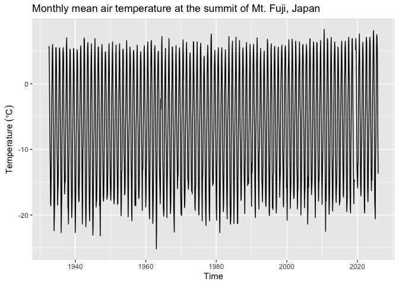<!-- -->

``` r
# The example data includes missing observation values
```

## Plotting Time Series of Temperature Anomalies

``` r
# Generate temperature anomalies
example_anomaly <- ThermoSSM::monthly_anomaly(fuji_temp)

monthly_example_anomaly_plot <- forecast::autoplot(example_anomaly) +
  labs(y = expression(Temperature~(degree*C)), 
       x = "Time") +
  ggtitle("Temperature anomaliese")
  
plot(monthly_example_anomaly_plot)
```

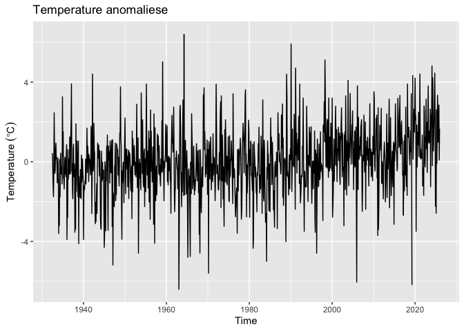<!-- -->

## Plotting Monthly Seasonal Cycle

``` r
monthly_seasonal_cycle_fuji <- ThermoSSM::mean_seasonal_cycle(fuji_temp) 
summary(monthly_seasonal_cycle_fuji)
```

    ##      Month        Temperature     
    ##  Min.   : 1.00   Min.   :-18.798  
    ##  1st Qu.: 3.75   1st Qu.:-14.716  
    ##  Median : 6.50   Median : -6.170  
    ##  Mean   : 6.50   Mean   : -6.319  
    ##  3rd Qu.: 9.25   3rd Qu.:  1.485  
    ##  Max.   :12.00   Max.   :  6.119

``` r
plt_monthly_seasonal_cycle_fuji <- ggplot(
  data = monthly_seasonal_cycle_fuji,
  aes(x = Month, y = Temperature)
) +
  geom_point(size = 2) +
  geom_line(linetype = "dashed") +
  labs(
    title = "Monthly seasonal cycle of temperature",
    x = "Month",
    y = expression(Temperature~(degree*C))
  ) +
  scale_x_continuous(
    breaks = 1:12,
    labels = sprintf("%02d", 1:12)
  )


plot(plt_monthly_seasonal_cycle_fuji)
```

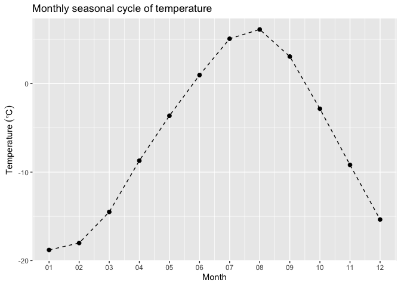<!-- -->

## Applying a Linear Gaussian State-Space Model

``` r
res <- lgssm(fuji_temp) 
summary(res)
```

    ## ThermoSSM summary
    ## -----------------
    ## Call:
    ## lgssm(temp_data = fuji_temp)
    ## 
    ## Model fit:
    ##   Log-likelihood : -2111.5 
    ##   k              : 6 
    ##   AIC            : 4235.01 
    ##   Converged      : TRUE 
    ## 
    ## Variance parameters:
    ##   Observation (H): 3.25814e-08 
    ##   State (Q trend): 8.95151e-09 
    ##   State (Q season): 0.0005177013 
    ##   State (Q ar): 2.443921 
    ## 
    ## Coefficient of auto-regression parameters:
    ##   AR1: 0.2141506 
    ##   AR2: -0.008769458

## Plotting Level, Drift, Seasonal, and Auto-Regressive Components

``` r
# plot each of components at once
plot(res)
```

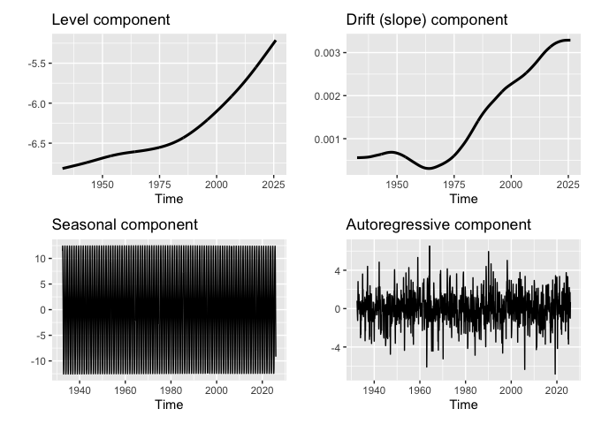<!-- -->

## Simple Model Diagnostics

``` r
# Normality of standardized residuals
std_obs_resid <- stats::rstandard(res$kfs, type = "recursive")

# Residual diagnostics
forecast::checkresiduals(std_obs_resid)
```

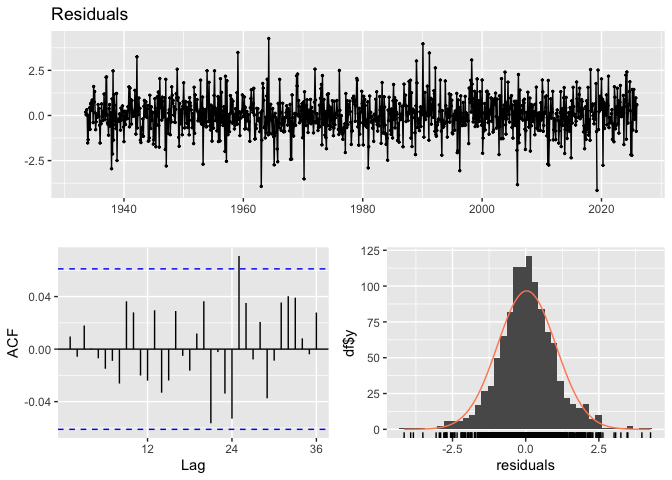<!-- -->

    ## 
    ##  Ljung-Box test
    ## 
    ## data:  Residuals
    ## Q* = 17.591, df = 24, p-value = 0.8224
    ## 
    ## Model df: 0.   Total lags used: 24

``` r
# Ljung–Box test: if P > 0.05, there is no evidence of significant autocorrelation in the residuals
# Inspect the diagnostic plots 
# top: residual time series;
# bottom left: residual autocorrelation;
# bottom right: histogram of residuals to check for outliers or other anomalies
```

## Estimated Parameters and Components

``` r
# Parameters including process errors and observation error
params <- ThermoSSM::extract_param(res)
params
```

    ##       Q_trend      Q_season           AR1           AR2          Q_ar 
    ##  8.951510e-09  5.177013e-04  2.141506e-01 -8.769458e-03  2.443921e+00 
    ##             H 
    ##  3.258140e-08

``` r
# Smoothing estimates
alpha_hat <- res$kfs$alphahat
head(alpha_hat)
```

    ##              level        slope sea_dummy1 sea_dummy2 sea_dummy3 sea_dummy4
    ## Jul 1932 -6.816754 0.0005590689  11.495327   7.219398   2.636248  -2.286643
    ## Aug 1932 -6.816195 0.0005590718  12.426540  11.495327   7.219398   2.636248
    ## Sep 1932 -6.815636 0.0005590778   9.344077  12.426540  11.495327   7.219398
    ## Oct 1932 -6.815077 0.0005590852   3.450236   9.344077  12.426540  11.495327
    ## Nov 1932 -6.814518 0.0005590897  -2.895071   3.450236   9.344077  12.426540
    ## Dec 1932 -6.813959 0.0005590907  -8.902299  -2.895071   3.450236   9.344077
    ##          sea_dummy5 sea_dummy6 sea_dummy7 sea_dummy8 sea_dummy9 sea_dummy10
    ## Jul 1932  -8.214384 -11.712963 -12.560467  -8.902299  -2.895071    3.450236
    ## Aug 1932  -2.286643  -8.214384 -11.712963 -12.560467  -8.902299   -2.895071
    ## Sep 1932   2.636248  -2.286643  -8.214384 -11.712963 -12.560467   -8.902299
    ## Oct 1932   7.219398   2.636248  -2.286643  -8.214384 -11.712963  -12.560467
    ## Nov 1932  11.495327   7.219398   2.636248  -2.286643  -8.214384  -11.712963
    ## Dec 1932  12.426540  11.495327   7.219398   2.636248  -2.286643   -8.214384
    ##          sea_dummy11      arima1        arima2
    ## Jul 1932    9.344077  0.82142718 -0.0015357329
    ## Aug 1932    3.450236  0.08965556 -0.0072034709
    ## Sep 1932   -2.895071 -0.72844076 -0.0007862306
    ## Oct 1932   -8.902299 -1.23515873  0.0063880304
    ## Nov 1932  -12.560467  0.20958905  0.0108316723
    ## Dec 1932  -11.712963  2.81625771 -0.0018379823

``` r
#　Smoothing estimate of level component
level_ts <- ThermoSSM::extract_level_ts(res)

#　Smoothing estimate of drift component
drift_ts <- ThermoSSM::extract_drift_ts(res)

# Average drift rate per year
mean_drift_year <- mean(drift_ts) * 12
print(mean_drift_year)
```

    ## [1] 0.01719616

``` r
# Average drift rate per year during 1950s
drift_per_year_1950s <- window(drift_ts,
                               start=c(1950,1),
                               end=c(1959,12)
                               ) %>%  mean()*12
print(drift_per_year_1950s)
```

    ## [1] 0.006333696

``` r
# Average drift rate per year during 2010s
drift_per_year_2010s <- window(drift_ts,
                               start=c(2010,1),
                               end=c(2019,12)
                               ) %>%  mean()*12
print(drift_per_year_2010s)
```

    ## [1] 0.03606578

## Plotting Level Component with 95% Confidence Interval

``` r
plt_level_ci <- plot(res,
                     components = "level",
                     ci = TRUE,
                     ci_level = 0.95
                     )

plot(plt_level_ci)
```

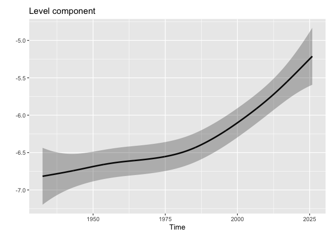<!-- -->

## Plotting Drift Component with 95% Confidence Interval

``` r
plt_drift_ci <- plot(res,
                     components = "drift",
                     ci = TRUE,
                     ci_level = 0.95
                     )

plot(plt_drift_ci)
```

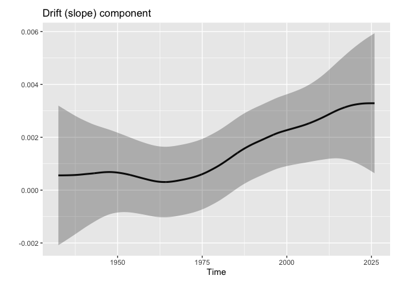<!-- -->

# Practice II: Analysis of Monthly Sea-Surface Temperature with Exogenous Variables

## Dataset is originated from Baba et al. (2024)

## Baba, S., Ishii, H., and Yoshiyama, T. (2024).

## Estimating sea temperature trends using a linear Gaussian state-space model in Jogashima, Kanagawa, Japan.

## Bulletin of the Japanese Society of Fisheries Oceanography, 88, 190–199 (in Japanese with English abstruct)

## <https://doi.org/10.34423/jsfo.88.3_190>

## Supplementary code and test data are available on GitHub repository:

## <https://github.com/logics-of-blue/sea-temperature-trend-jogashima>

## loading dataset and converting ts object

``` r
baba_data <- readr::read_csv("https://raw.githubusercontent.com/logics-of-blue/sea-temperature-trend-jogashima/refs/heads/main/src/ssm-sample-data.csv")

# time　　　：日付(論文では0.5か月だが、本サンプルコードでは月単位データとした)
# temp　　　：水温
# distance　：黒潮流軸までの距離
# kuroshio_a：黒潮流路がA型のときに1をとるフラグ
head(baba_data)
```

    ## # A tibble: 6 × 4
    ##   time        temp distance kuroshio_a
    ##   <date>     <dbl>    <dbl>      <dbl>
    ## 1 1998-01-01  16.2      116          0
    ## 2 1998-02-01  13.8      148          0
    ## 3 1998-03-01  16.4       49          0
    ## 4 1998-04-01  16.5      131          0
    ## 5 1998-05-01  19.7       45          0
    ## 6 1998-06-01  21.8       40          0

``` r
# 秋冬の黒潮Aフラグの追加
baba_data <- 
  baba_data %>% 
  mutate(winter = as.numeric(lubridate::month(as.Date(time)) %in% c(11, 12, 1, 2, 3)),
         winter_a = winter * kuroshio_a)

# winter　：秋冬に1をとるフラグ
# winter_a：秋冬かつ、黒潮がAであるときに1をとるフラグ
head(baba_data)
```

    ## # A tibble: 6 × 6
    ##   time        temp distance kuroshio_a winter winter_a
    ##   <date>     <dbl>    <dbl>      <dbl>  <dbl>    <dbl>
    ## 1 1998-01-01  16.2      116          0      1        0
    ## 2 1998-02-01  13.8      148          0      1        0
    ## 3 1998-03-01  16.4       49          0      1        0
    ## 4 1998-04-01  16.5      131          0      0        0
    ## 5 1998-05-01  19.7       45          0      0        0
    ## 6 1998-06-01  21.8       40          0      0        0

``` r
# ts型に変換
# 0.5か月単位データの場合はfrequency = 24と指定する
baba_data_ts <- 
  baba_data %>% 
  dplyr::select(-time, -winter) %>%             # 日付列と秋冬フラグを削除
  ts(start = c(1998, 1), frequency = 12) # ts型に変換(1998年1月開始。12か月1周期)
head(baba_data_ts)
```

    ##           temp distance kuroshio_a winter_a
    ## Jan 1998 16.19      116          0        0
    ## Feb 1998 13.82      148          0        0
    ## Mar 1998 16.44       49          0        0
    ## Apr 1998 16.49      131          0        0
    ## May 1998 19.70       45          0        0
    ## Jun 1998 21.83       40          0        0

## Splitting temperature data and exogenous variables

``` r
# ts object of temperature time series
baba_temp_ts <- baba_data_ts[,"temp"]

# ts object of exogenous variables
baba_exo_ts <- baba_data_ts[,c("distance","kuroshio_a", "winter_a")]
```

## Plotting Time Series of Temperature

``` r
plt_baba_temp <- forecast::autoplot(baba_temp_ts) +
  labs(y = expression(Temperature~(degree*C)), 
       x = "Time") +
  ggtitle("Monthly mean sea-surface temperature")

plot(plt_baba_temp)
```

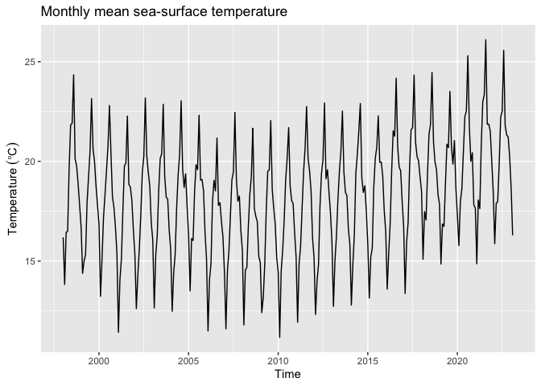<!-- -->

## Plotting Time Series of Exogenous variables

``` r
plt_baba_exo_distance <- forecast::autoplot(baba_exo_ts[,"distance"]) +
  labs(x = "Time", y = "Distance") +
  ggtitle("Distance")

plt_baba_exo_kuroshio_a <- forecast::autoplot(baba_exo_ts[,"kuroshio_a"]) +
  labs(x = "Time", y = "Category") +
  ggtitle("kuroshio_a")

plt_baba_exo_winter_a <- forecast::autoplot(baba_exo_ts[,"winter_a"]) +
  labs(x = "Time",y = "Category") +
  ggtitle("winter_a")

cowplot::plot_grid(plt_baba_exo_distance,
                   plt_baba_exo_kuroshio_a,
                   plt_baba_exo_winter_a,
                   ncol=1)
```

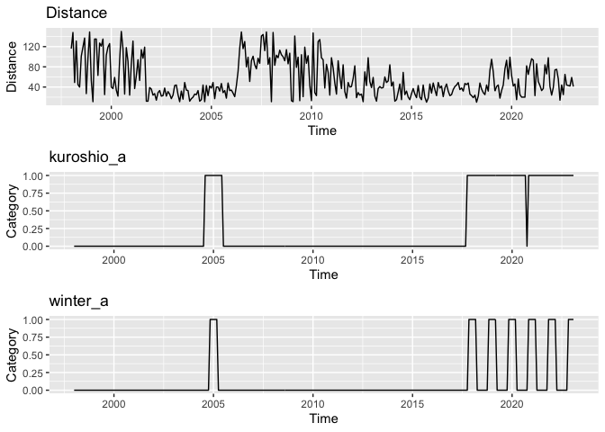<!-- -->

## Applying a Linear Gaussian State-Space Model without exogenous variables

``` r
res_baba_without <- lgssm(baba_temp_ts) 
summary(res_baba_without)
```

    ## ThermoSSM summary
    ## -----------------
    ## Call:
    ## lgssm(temp_data = baba_temp_ts)
    ## 
    ## Model fit:
    ##   Log-likelihood : -227.35 
    ##   k              : 6 
    ##   AIC            : 466.7 
    ##   Converged      : TRUE 
    ## 
    ## Variance parameters:
    ##   Observation (H): 0.05517445 
    ##   State (Q trend): 4.945284e-06 
    ##   State (Q season): 0.0001859982 
    ##   State (Q ar): 0.1497551 
    ## 
    ## Coefficient of auto-regression parameters:
    ##   AR1: 0.6553233 
    ##   AR2: 0.07430061

``` r
# plot each of components at once
plot(res_baba_without)
```

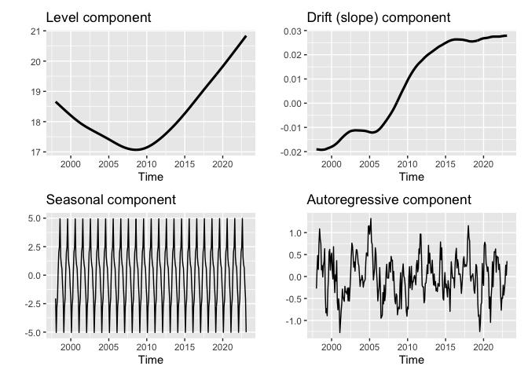<!-- -->

## Applying a Linear Gaussian State-Space Model with exogenous variables

``` r
res_baba_with <- lgssm(temp_data=baba_temp_ts,
                          exo_data=baba_exo_ts) 
summary(res_baba_with)
```

    ## ThermoSSM summary
    ## -----------------
    ## Call:
    ## lgssm(temp_data = baba_temp_ts, exo_data = baba_exo_ts)
    ## 
    ## Model fit:
    ##   Log-likelihood : -180.38 
    ##   k              : 9 
    ##   AIC            : 378.76 
    ##   Converged      : TRUE 
    ## 
    ## Variance parameters:
    ##   Observation (H): 2.580148e-10 
    ##   State (Q trend): 4.160215e-06 
    ##   State (Q season): 9.523315e-05 
    ##   State (Q ar): 0.1537217 
    ## 
    ## Coefficient of auto-regression parameters:
    ##   AR1: 0.6009063 
    ##   AR2: 0.0443539 
    ## 
    ## Exogenous variable    distance kuroshio_a winter_a 
    ## Estimated coefficient     -0.006860767 0.3222738 0.7399126 
    ## Lower CI  -0.008223095 -0.01808114 0.4660077 
    ## Upper CI  -0.005498439 0.6626288 1.013818

``` r
# plot each of components at once
plot(res_baba_with)
```

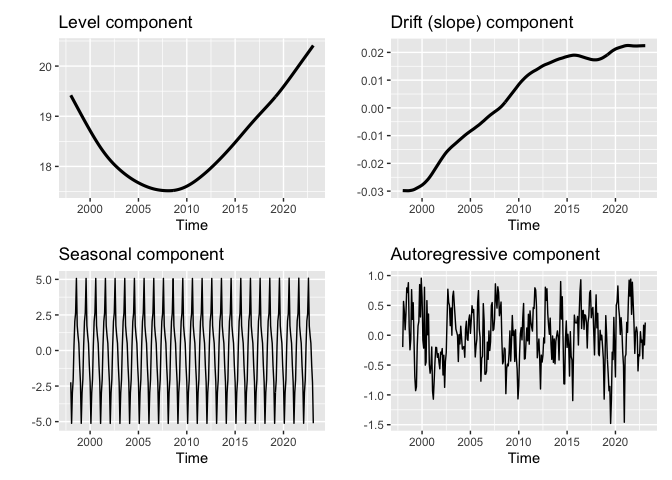<!-- -->

## time series Cross-Validation

``` r
# ts CV of the model without exogenous variables

## Generate list of train/test data and their indexes
# 年単位のtsCV用の訓練/テストデータの作成方法
# 1) 1998年1月から2016年12月までを訓練データ、2017年１月からの1年分をテストデータ
# 2) 1998年1月から2017年12月までを訓練データ、2018年１月からの1年分をテストデータ
# ...
# 6) 1998年1月から2017年12月までを訓練データ、2022年１月からの1年分をテストデータ
# 以上の処理をts_cv_folds()関数で自動作成
folds_6years_without <- ts_cv_folds(temp_data=baba_temp_ts,
                                 exo_data = NULL,
                                 initial = 228, # 228 monthly units from 1998-Jan to 2016-Dec 
                                 horizon = 12,
                                 step = 12,
                                 fixed_window = FALSE,
                                 allow_partial = FALSE) 

## Performe tsCV
cv_meta_without <- rolling_origin_tsCV(folds_6years_without, fold_ids=seq(1:6)) # Hold on a few minutes
#cv_meta_without <- rolling_origin_tsCV(folds_6years_without, fold_ids=1) # Hold on a few minutes

cv_without <- map(cv_meta_without, pluck, "CV", .default = NULL)

cv_without_tidy <- cv_without %>%
  map(~ as.data.frame(.x) %>%tibble::rownames_to_column(var = "set")) %>%
  purrr::list_rbind(names_to = "cv_id") %>%
  mutate(Model="Without") %>%
  dplyr::relocate(Model,cv_id, set)  # 識別列を先頭に

print(cv_without_tidy)
```

    ##     Model cv_id      set         ME      RMSE       MAE        MPE     MAPE
    ## 1 Without     1 Test set  0.1840780 0.4007181 0.3021636  0.7756497 1.596606
    ## 2 Without     2 Test set -0.2512263 0.6065959 0.5782862 -1.1540092 3.060408
    ## 3 Without     3 Test set -0.4457947 0.8557703 0.7790297 -2.1009569 3.992982
    ## 4 Without     4 Test set  0.2496385 0.7477649 0.6446000  1.2783092 3.422325
    ## 5 Without     5 Test set  0.8037154 0.8995830 0.8037154  3.8389907 3.838991
    ## 6 Without     6 Test set -0.4508430 0.6042668 0.5082331 -2.1696072 2.473141
    ##         ACF1 Theil's U MASE_naive MASE_snaive
    ## 1  0.3203994 0.1814806  0.1770779   0.4250559
    ## 2  0.5288184 0.2908381  0.3386929   0.8351761
    ## 3  0.4653185 0.4238365  0.4563065   1.1299839
    ## 4  0.2794547 0.4320052  0.3779760   0.9417857
    ## 5 -0.3137596 0.3938901  0.4709805   1.1399606
    ## 6  0.2922700 0.3238430  0.2974184   0.7137815

``` r
#----------------------------------------------------------
# ts CV of the model with exogenous variables
## Generate list of train/test data and their indexes
folds_6years_with <- ts_cv_folds(temp_data=baba_temp_ts,
                     exo_data = baba_exo_ts,
                        initial = 228, # 228 monthly units from 1998-Jan to 2016-Dec 
                        horizon = 12,
                        step = 12,
                        fixed_window = FALSE,
                        allow_partial = FALSE) 

## Performe tsCV
cv_meta_with <- rolling_origin_tsCV(folds_6years_with, fold_ids=seq(1:6)) # Hold on a few minutes

cv_with <- map(cv_meta_with, pluck, "CV", .default = NULL)
#cv_with <- base::lapply(cv_meta_with, `[[`, "CV")

cv_with_tidy <- cv_with %>%
  map(~ as.data.frame(.x) %>%tibble::rownames_to_column(var = "set")) %>%
  purrr::list_rbind(names_to = "cv_id") %>%
  mutate(Model="With") %>%
  dplyr::relocate(Model,cv_id, set)  # 識別列を先頭に

print(cv_with_tidy)
```

    ##   Model cv_id      set         ME      RMSE       MAE        MPE     MAPE
    ## 1  With     1 Test set -0.0313825 0.4558111 0.3579344 -0.2668966 1.859228
    ## 2  With     2 Test set -0.4882979 0.6901558 0.5796116 -2.4776204 2.978092
    ## 3  With     3 Test set -0.3151896 0.6595790 0.5492322 -1.4907984 2.802321
    ## 4  With     4 Test set  0.4982363 0.8373174 0.7631218  2.4099787 3.902438
    ## 5  With     5 Test set  1.0247984 1.0784292 1.0247984  4.8807398 4.880740
    ## 6  With     6 Test set -0.3037580 0.3982281 0.3145223 -1.4765876 1.529745
    ##         ACF1 Theil's U MASE_naive MASE_snaive
    ## 1  0.5069573 0.2056400  0.2097615   0.5035091
    ## 2  0.4334518 0.3309232  0.3394691   0.8370903
    ## 3  0.5267685 0.3171160  0.3217056   0.7966622
    ## 4  0.3535131 0.4659375  0.4474740   1.1149507
    ## 5  0.2085317 0.4434044  0.6005361   1.4535367
    ## 6 -0.0670909 0.1969585  0.1840587   0.4417269

``` r
cv_tidy <- bind_rows(cv_without_tidy,cv_with_tidy)
cv_tidy$Model <- factor(cv_tidy$Model,
                        levels=c("Without","With"))

plot_MAE <- ggplot(data=cv_tidy,
                   aes(x=Model,y=MAE)) +
  geom_boxplot()

plot_MAPE <- ggplot(data=cv_tidy,
                   aes(x=Model,y=MAPE)) +
  geom_boxplot()

plot_MASE_naive <- ggplot(data=cv_tidy,
                   aes(x=Model,y=MASE_naive)) +
  geom_boxplot()

plot_MASE_snaive <- ggplot(data=cv_tidy,
                   aes(x=Model,y=MASE_snaive)) +
  geom_boxplot()

cowplot::plot_grid(plot_MAE,plot_MAPE,plot_MASE_naive,plot_MASE_snaive,nrow=1)
```

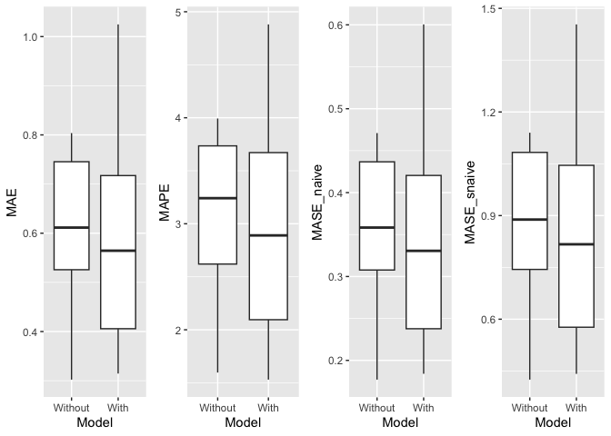<!-- -->

## ==============================================

# Appendix: Example Data and the `sst_jma2ts()` Function

## Example Data 2: Monthly air temperature at Mt. Akadake, Hokkaido, Japant

## Duration: August 2010 to August 2023

## The data originated from: <https://www.biodic.go.jp/moni1000/findings/data/index.html>.

## The ThermoSSM package provides the file “example_monthly_temp.csv”, containging example data.

## Format of the csv file is as follows:

## 

## Year, Month, Temp

## 2010,8,13.6

## 2010,9,6.8

## 2010,10,0.2

## …

``` r
example_csv_path <- system.file("extdata", "example_monthly_temp.csv", package = "ThermoSSM")
example_temp <- readr::read_csv(example_csv_path)
head(example_temp)
```

    ## # A tibble: 6 × 3
    ##    Year Month  Temp
    ##   <dbl> <dbl> <dbl>
    ## 1  2010     8  13.6
    ## 2  2010     9   6.8
    ## 3  2010    10   0.2
    ## 4  2010    11  -6.8
    ## 5  2010    12 -12.5
    ## 6  2011     1 -18.8

``` r
# Converting tidy object to ts object
MtAkadake_ts <- ts(matrix(example_temp$Temp),
  start = c(example_temp$Year[1],example_temp$Month[1]),
  frequency = 12
)

colnames(MtAkadake_ts) <- "Temp"
head(MtAkadake_ts)
```

    ##        Jan Feb Mar Apr May Jun Jul   Aug   Sep   Oct   Nov   Dec
    ## 2010                                13.6   6.8   0.2  -6.8 -12.5
    ## 2011 -18.8

``` r
frequency(MtAkadake_ts)
```

    ## [1] 12

``` r
start(MtAkadake_ts)
```

    ## [1] 2010    8

``` r
end(MtAkadake_ts)
```

    ## [1] 2023    8

``` r
# Perform linear Gaussian state-space modelling
res_MtAkadake <- lgssm(MtAkadake_ts)
summary(res_MtAkadake)
```

    ## ThermoSSM summary
    ## -----------------
    ## Call:
    ## lgssm(temp_data = MtAkadake_ts)
    ## 
    ## Model fit:
    ##   Log-likelihood : -275.2 
    ##   k              : 6 
    ##   AIC            : 562.39 
    ##   Converged      : TRUE 
    ## 
    ## Variance parameters:
    ##   Observation (H): 1.178218 
    ##   State (Q trend): 1.49781e-06 
    ##   State (Q season): 0.03304002 
    ##   State (Q ar): 0.6614562 
    ## 
    ## Coefficient of auto-regression parameters:
    ##   AR1: 0.4869715 
    ##   AR2: -0.2836264

``` r
plot(res_MtAkadake)
```

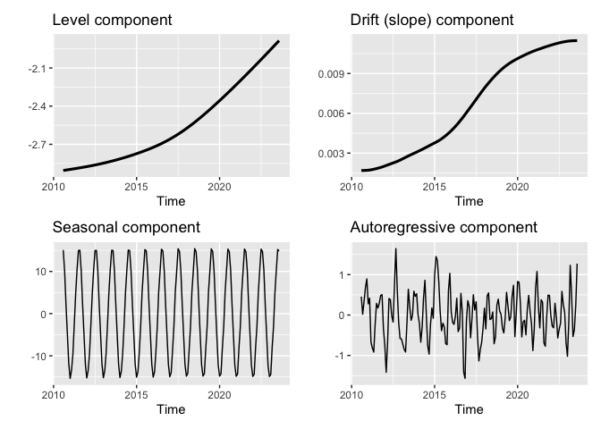<!-- -->

## Example Data 3: Daily sea-surface temperature off the southern coast of Ibaraki Prefecture, Japan

### Duration: January 1982 to December 2025

### This dataset consists of publicly available daily sea-surface temperature data released by the Japan

### Meteorological Agency (JMA) (<https://www.jma.go.jp/jma/indexe.html>).

``` r
# A zoo object of daily sea-surface temperature (SST)
# off the southern coast of Ibaraki Prefecture, Japan
data(ibaraki_sst) 
head(ibaraki_sst)
```

    ##             Temp
    ## 1982-01-01 16.21
    ## 1982-01-02 16.28
    ## 1982-01-03 16.36
    ## 1982-01-04 16.36
    ## 1982-01-05 16.22
    ## 1982-01-06 16.04

``` r
# Convert the daily zoo object to a monthly ts object
monthly_ibaraki_sst_ts <- ThermoSSM::zoo_daily2ts_monthly(ibaraki_sst)
head(monthly_ibaraki_sst_ts)
```

    ##           Jan      Feb      Mar      Apr      May      Jun
    ## 1982 15.04419 14.22500 13.63903 15.31933 17.52258 19.52300

``` r
# Converting from daily zoo object to monthly ts object
monthly_ibaraki_sst_ts <- ThermoSSM::zoo_daily2ts_monthly(ibaraki_sst)
head(monthly_ibaraki_sst_ts)
```

    ##           Jan      Feb      Mar      Apr      May      Jun
    ## 1982 15.04419 14.22500 13.63903 15.31933 17.52258 19.52300

``` r
# Perform linear Gaussian state-space modelling
res_ibaraki_sst <- lgssm(monthly_ibaraki_sst_ts)
summary(res_ibaraki_sst)
```

    ## ThermoSSM summary
    ## -----------------
    ## Call:
    ## lgssm(temp_data = monthly_ibaraki_sst_ts)
    ## 
    ## Model fit:
    ##   Log-likelihood : -603 
    ##   k              : 6 
    ##   AIC            : 1218 
    ##   Converged      : TRUE 
    ## 
    ## Variance parameters:
    ##   Observation (H): 1.72128e-43 
    ##   State (Q trend): 5.008495e-06 
    ##   State (Q season): 0.0001880851 
    ##   State (Q ar): 0.5141963 
    ## 
    ## Coefficient of auto-regression parameters:
    ##   AR1: 0.6923188 
    ##   AR2: -0.1245904

``` r
plot(res_ibaraki_sst)
```

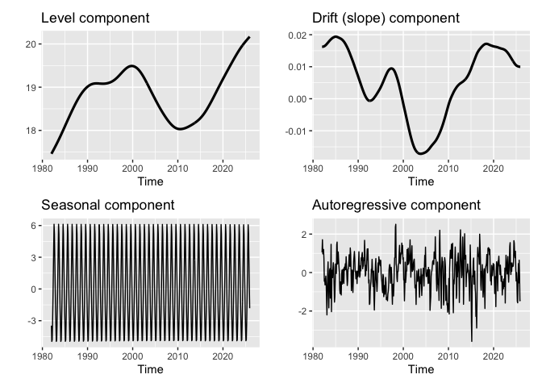<!-- -->

## Utility Function: sst_jma2ts()

### This function downloads publicly available daily mean sea-surface temperature (SST) data

### for Japanese coastal waters provided by the Japan Meteorological Agency (JMA),

### and returns the corresponding monthly mean time series as an object of class ts.

``` r
#' @param sea_area_id
#' Numeric sea area ID. The default is NULL.
#' For example, 138 corresponds to the coastal waters off southern Ibaraki, Japan.
#' A list of sea area IDs and their corresponding regions is available at:
#' \url{https://www.data.jma.go.jp/kaiyou/data/db/kaikyo/series/engan/eg_areano.html}
```

``` r
# Download SST data for the southern coastal waters of Ibaraki Prefecture, Japan
sst_138_ts <- ThermoSSM::sst_jma2ts(sea_area_id = 138) 
head(sst_138_ts)
```

    ##           Jan      Feb      Mar      Apr      May      Jun
    ## 1982 15.04419 14.22500 13.63903 15.31933 17.52258 19.52300
